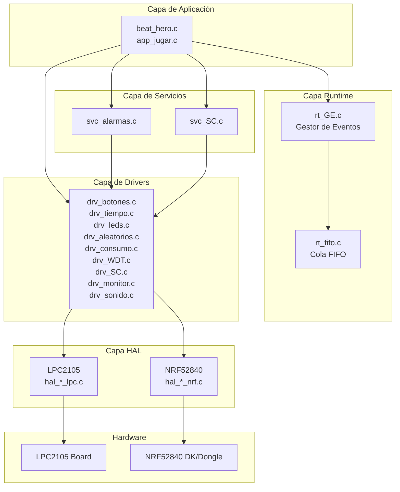
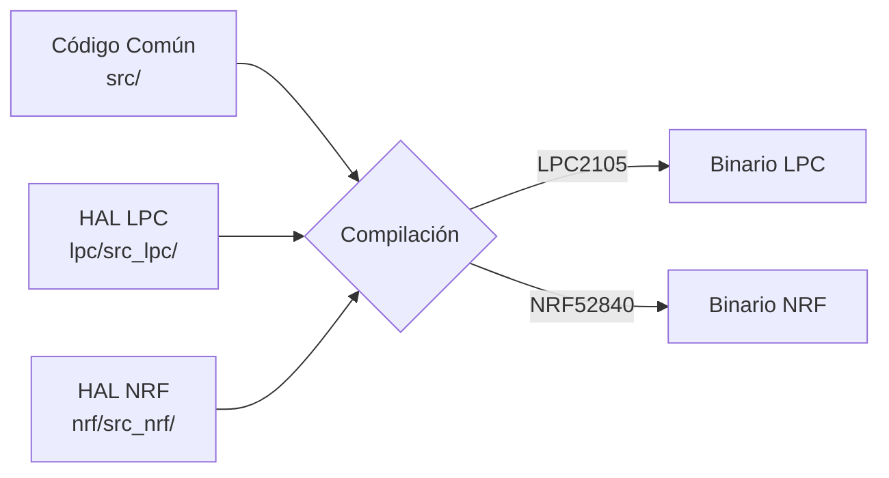
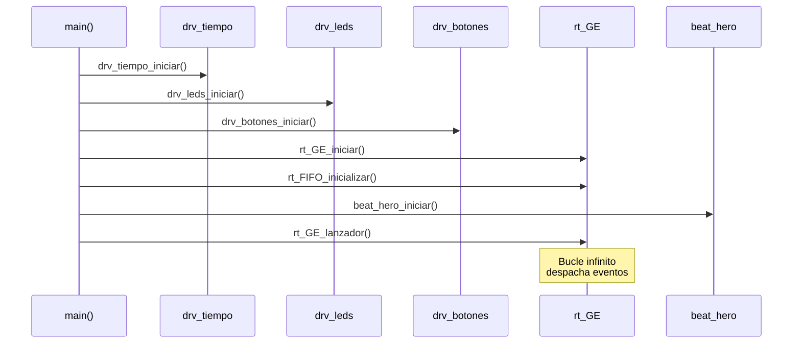

# 📚 Documentación Proyecto Beat Hero

## Descripción del Proyecto

Beat Hero es un sistema embebido de tipo "rhythm game" implementado para dos plataformas diferentes:
- **LPC2105** (ARM7TDMI-S)
- **NRF52840** (ARM Cortex-M4)

El proyecto sigue una arquitectura por capas que permite la portabilidad del código mediante una capa de abstracción de hardware (HAL).

## Arquitectura del Sistema



## Plataformas Soportadas

### LPC2105
- **Procesador**: ARM7TDMI-S a 60 MHz
- **LEDs**: 4 LEDs (estado activo HIGH)
- **Botones**: 3 botones (INT_EXT1, INT_EXT2, INT_EXT3)
- **Monitores Debug**: 4 pines GPIO

### NRF52840 DK
- **Procesador**: ARM Cortex-M4 a 64 MHz
- **LEDs**: 4 LEDs (P0.13-P0.16, estado activo LOW)
- **Botones**: 4 botones (P0.11, P0.12, P0.24, P0.25)
- **Buzzer**: P0.3
- **Monitores Debug**: 4 pines GPIO (P0.28-P0.31)

## Índice de Documentación por Funcionalidad

### 🎮 Aplicación
1. [**Juego Beat Hero**](01_JUEGO.md) - Lógica principal del juego y máquina de estados

### ⚙️ Entrada/Salida
2. [**Manejo de Botones**](02_BOTONES.md) - Detección de pulsaciones con anti-rebote
3. [**Control de LEDs**](09_LEDS.md) - Gestión de LEDs para feedback visual
4. [**Sistema de Sonido**](15_SONIDO.md) - Control de buzzer/audio
5. [**GPIO**](06_GPIO.md) - Configuración y control de pines GPIO

### ⏱️ Temporización
6. [**Gestión de Tiempo**](03_TIEMPO.md) - Base de tiempos del sistema
7. [**Sistema de Alarmas**](04_ALARMAS.md) - Temporizadores programables

### 🔄 Gestión de Eventos
8. [**Sistema de Eventos**](11_EVENTOS.md) - Gestor de eventos (rt_GE)
9. [**Cola FIFO**](12_FIFO.md) - Cola de eventos

### 🛡️ Protección y Seguridad
10. [**Watchdog Timer**](05_WATCHDOG.md) - Protección contra bloqueos
11. [**Secciones Críticas**](13_SECCION_CRITICA.md) - Protección de recursos compartidos

### 🎲 Utilidades
12. [**Generación de Números Aleatorios**](08_ALEATORIOS.md) - RNG para secuencias del juego
13. [**Gestión de Consumo**](10_CONSUMO.md) - Modos de bajo consumo

### 🐛 Debug
14. [**Sistema de Monitor**](14_MONITOR.md) - Herramientas de debug y profiling
15. [**Interrupciones**](07_INTERRUPCIONES.md) - Configuración y manejo de interrupciones

## Convenciones del Proyecto

### Nomenclatura de Archivos

| Prefijo | Descripción | Ubicación |
|---------|-------------|-----------|
| `app_*` | Capa de aplicación | `/src` |
| `svc_*` | Capa de servicios | `/src` |
| `rt_*` | Capa de runtime | `/src` |
| `drv_*` | Capa de drivers | `/src` |
| `hal_*` | Capa de abstracción de hardware | `/lpc/src_lpc` o `/nrf/src_nrf` |
| `board_*` | Definición de la placa | `/lpc/src_lpc` o `/nrf/src_nrf` |

### Tipos de Datos

- **`EVENTO_T`**: Tipo enumerado para eventos del sistema
- **`Tiempo_us_t`**: Tipo para tiempos en microsegundos (uint64_t)
- **`Tiempo_ms_t`**: Tipo para tiempos en milisegundos (uint32_t)

### Flujo de Compilación



El código en `/src` es común a ambas plataformas. La selección de HAL se realiza mediante definiciones del preprocesador:
- `LPC2105_simulador` → Incluye `board_lpc.h`
- `BOARD_PCA10056` → Incluye `board_nrf52840dk.h`
- `BOARD_PCA10059` → Incluye `board_nrf52840_dongle.h`

## Flujo de Inicialización del Sistema



## Modo Debug vs Release

El proyecto incluye soporte para testing:

```c
#ifdef DEBUG
    // Ejecutar suite de tests automáticos
    test_ejecutar_todos();
#else
    // Iniciar el juego Beat Hero
    beat_hero_iniciar();
    rt_GE_lanzador(); // Event loop
#endif
```

## Recursos Adicionales

- [Diagrama FSM Beat Hero](../fsm_beat_hero.md)
- [Diagrama FSM Driver Botones](../fsm_drv_botones.md)

## Contacto

Proyecto de Proyecto Hardware - Ingeniería Informática 3º Año

---

**Última actualización**: Diciembre 2024
