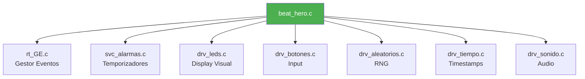
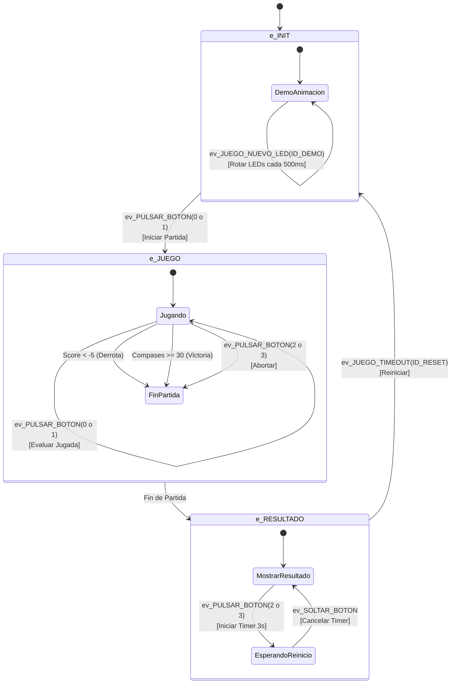
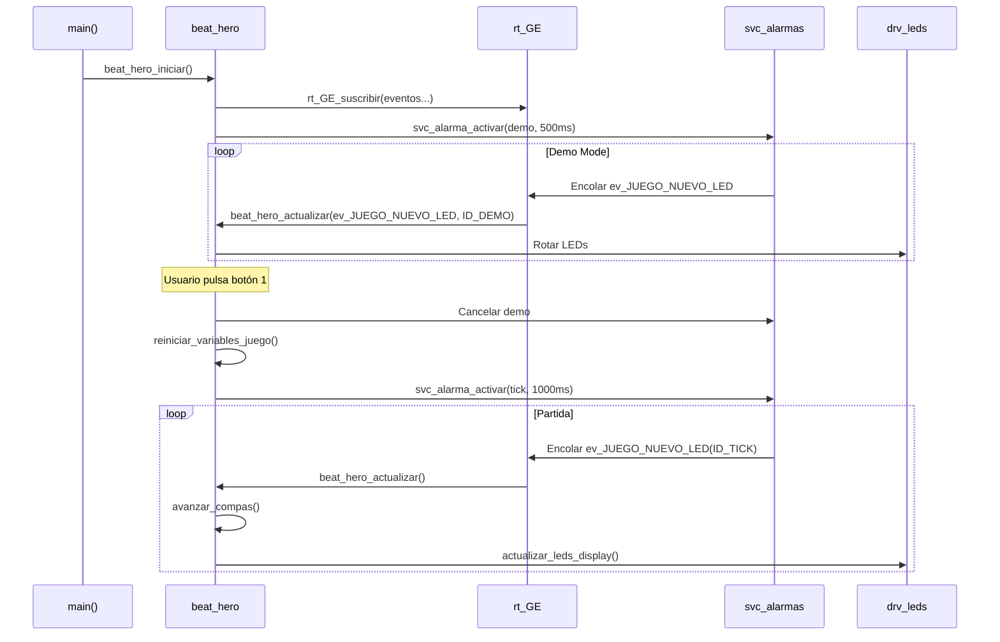

# 🎮 Funcionalidad: Juego Beat Hero

## Introducción

Beat Hero es un rhythm game donde el jugador debe pulsar los botones correctos siguiendo el patrón de LEDs mostrado. El juego gestiona:
- Máquina de estados del flujo del juego (Menú → Partida → Resultado)
- Sistema de puntuación con mecánicas de combo y timing
- Generación dinámica de patrones aleatorios
- Incremento progresivo de dificultad

## Arquitectura de Componentes



## Archivos Implicados

| Archivo | Tipo | Descripción |
|---------|------|-------------|
| `beat_hero.c` | Aplicación | Lógica principal del juego |
| `beat_hero.h` | Aplicación | Interfaz pública |
| `app_jugar.c` | Aplicación | Capa adicional de juego (sin usar actualmente) |

**Nota**: Este módulo **NO tiene capa HAL** porque es código de aplicación puro que se ejecuta sobre los drivers.

## Máquina de Estados (FSM)



### Estados del Juego

#### 1. **e_INIT** (Menú Principal / Demo)
- **Comportamiento**: Animación rotativa de LEDs cada 500ms
- **Evento de activación**: `ev_JUEGO_NUEVO_LED` con `auxData == ID_ALARMA_DEMO (200)`
- **Transición**: Pulsar botón 0 o 1 → inicia partida

#### 2. **e_JUEGO** (Partida en Curso)
- **Tick de Juego**: Timer periódico según BPM (inicial: 60 BPM = 1000ms por compás)
- **Mecánica de Compases**:
  - Array `compas[3]`: Representa 3 "beats" (pasado, presente, futuro)
  - Cada tick: se desplaza el array y genera nuevo patrón aleatorio
  - LEDs 1-2 muestran `compas[2]` (siguiente nota)
  - LEDs 3-4 muestran `compas[1]` (nota actual a pulsar)
  
- **Sistema de Puntuación**:
  | Timing (% del compás) | Puntos | Tipo |
  |----------------------|--------|------|
  | 0-10% | +2 | Perfecto |
  | 11-20% | +1 | Bueno |
  | 21-40% | 0 | Normal (mantiene combo) |
  | >40% | -1 | Fallo por timing |
  | Botón incorrecto | -1 | Fallo |
  | No pulsar | -1 | Miss |

- **Progresión de Dificultad**:
  - Cada 5 compases: incrementa nivel (máx 4)
  - Nivel 4: reduce duración de compás en 10%
  - Mayor nivel → más patrones complejos (0-3 botones)

#### 3. **e_RESULTADO** (Pantalla Final)
- **Victoria**: Todos los LEDs encendidos
- **Derrota**: LEDs 1 y 4 encendidos (cruz)
- **Reinicio**: Mantener botón 2 o 3 durante 3 segundos

## Estructura de Datos

### Estadísticas del Juego (`BeatHeroStats_t`)

```c
typedef struct {
    int32_t  Score;                  // Puntuación actual
    int32_t  HighScore;              // Mejor puntuación
    uint8_t  Nivel;                  // Nivel de dificultad (1-4)
    uint32_t CompasActual;           
    
    // Métricas de Rendimiento
    uint32_t NotasAcertadas;         
    uint32_t NotasFalladas;          
    uint32_t ComboActual;            
    uint32_t MaxCombo;               
    
    // Desglose de Aciertos
    uint32_t AciertosPerfectos;      // 2 puntos
    uint32_t AciertosBuenos;         // 1 punto
    uint32_t AciertosNormales;       // 0 puntos
    
    // Métricas de Tiempo
    int32_t  UltimoTiempoReaccion_ms;
    int32_t  PromedioReaccion_ms;
    uint64_t SumaTiemposReaccion;
} BeatHeroStats_t;

volatile BeatHeroStats_t juego_stats = {0}; // Accesible desde debugger
```

Esta estructura es `volatile` para permitir inspección en tiempo real desde el debugger.

## Funciones Principales

### `void beat_hero_iniciar(void)`

**Propósito**: Inicializar el subsistema del juego

**Acciones**:
1. Poner estado en `e_INIT`
2. Suscribirse a eventos del gestor:
   - `ev_JUEGO_NUEVO_LED` (ticks y demo)
   - `ev_PULSAR_BOTON` (input del jugador)
   - `ev_SOLTAR_BOTON` (cancelar reinicio)
   - `ev_JUEGO_TIMEOUT` (timeout de reinicio)
3. Reiniciar variables
4. Iniciar animación demo (500ms)

**Pre-requisitos**: Drivers (`drv_leds`, `drv_botones`, `svc_alarmas`, `drv_aleatorios`) deben estar inicializados.

### `void beat_hero_actualizar(EVENTO_T evento, uint32_t auxData)`

**Propósito**: Máquina de estados principal del juego (callback del gestor de eventos)

**Parámetros**:
- `evento`: Tipo de evento (`EVENTO_T`)
- `auxData`: Datos adicionales (ID de botón, ID de alarma, etc.)

**Lógica**: Switch basado en `s_estado` → procesa eventos según estado actual

### `static void avanzar_compas(void)` ⭐

**Propósito**: Desplazar el array de compases y generar nuevo patrón

**Algoritmo**:
```c
// 1. Penalizar si no se pulsó la nota actual
if (compas[0] != 0) {
    s_score--;
    juego_stats.ComboActual = 0;
}

// 2. Desplazar array
compas[0] = compas[1];
compas[1] = compas[2];

// 3. Generar nuevo patrón según nivel
uint32_t rnd = drv_aleatorios_rango(100);
if (s_nivel_dificultad == 1)
    compas[2] = (rnd > 50) ? 1 : 2;  // Solo 1 botón
else if (s_nivel_dificultad == 2)
    compas[2] = (rnd < 20) ? 0 : ((rnd < 60) ? 1 : 2);  // 0-2 botones
else
    compas[2] = ...  // 0-3 botones
```

**Codificación de Patrones**:
| Valor | Binario | Botones |
|-------|---------|---------|
| 0 | `00` | Ninguno (silencio) |
| 1 | `01` | Botón 1 |
| 2 | `10` | Botón 2 |
| 3 | `11` | Botones 1 y 2 (acorde) |

### `static void evaluar_jugada(uint8_t input_mask)` ⭐

**Propósito**: Evaluar la pulsación del jugador y actualizar puntuación

**Lógica Detallada**:

```c
if (compas[0] == 0) {
    // No había nota que pulsar → penalizar
    s_score--;
    return;
}

if (compas[0] & input_mask) {
    // Botón CORRECTO
    int puntos = calcular_puntuacion(drv_tiempo_actual_us());
    s_score += puntos;
    compas[0] &= ~input_mask;  // Marcar como pulsado
    
    if (puntos >= 0) {
        // Timing aceptable → incrementar combo
        juego_stats.ComboActual++;
    } else {
        // Timing muy malo (-1 puntos) → romper combo
        juego_stats.ComboActual = 0;
    }
} else {
    // Botón INCORRECTO
    s_score--;
    juego_stats.ComboActual = 0;
}
```

**Detalle Importante**: Si el patrón es `3` (acorde), el jugador debe pulsar **ambos** botones. La máscara permite detección individual.

## Configuración Hardware

| Parámetro | Valor | Descripción |
|-----------|-------|-------------|
| `MAX_COMPASES_PARTIDA` | 30 | Compases para ganar |
| `SCORE_MIN_FAIL` | -5 | Score mínimo antes de Game Over |
| `BPM_INICIAL` | 60 | Tempo inicial (1 segundo/compás) |
| `TIEMPO_REINICIO_MS` | 3000 | Tiempo para reiniciar (mantener botón) |

### IDs de Alarmas

```c
#define ID_ALARMA_RESET  50   // Timeout de reinicio
#define ID_ALARMA_TICK   100  // Tick de juego
#define ID_ALARMA_DEMO   200  // Animación demo
```

Estos IDs se usan como `auxData` en los eventos para discriminar qué alarma disparó.

## Flujo de Ejecución Típico



## Dependencias

### Módulos Necesarios

1. **rt_GE.c**: Sistema de eventos (suscripción y dispatch)
2. **svc_alarmas.c**: Temporizadores para ticks de juego
3. **drv_leds.c**: Visualización de patrones
4. **drv_botones.c**: Captura de input
5. **drv_tiempo.c**: Timestamps para cálculo de timing
6. **drv_aleatorios.c**: Generación de patrones
7. **drv_sonido.c**: Feedback sonoro (opcional, según plataforma)

### Eventos Consumidos

| Evento | Origen | Propósito |
|--------|--------|-----------|
| `ev_JUEGO_NUEVO_LED` | `svc_alarmas` | Tick de juego / Demo |
| `ev_PULSAR_BOTON` | `drv_botones` | Input del jugador |
| `ev_SOLTAR_BOTON` | `drv_botones` | Cancelar reinicio |
| `ev_JUEGO_TIMEOUT` | `svc_alarmas` | Timeout de reinicio |

## Observaciones Técnicas

### 1. **Gestión de Memoria**
- Todas las variables son `static` → asignadas en BSS/Data
- `juego_stats` es `volatile` para debug, no por multithreading

### 2. **Precisión Temporal**
- Usa timestamps de `drv_tiempo_actual_us()` (microsegundos)
- Cálculo de timing: `(now - s_tiempo_inicio_compas) / 1000` → ms

### 3. **Portabilidad**
- **100% independiente del hardware**
- Solo usa interfaces de drivers (no HAL directo)
- Funciona idéntico en LPC y NRF

### 4. **Sistema de Combos**
- Resetear combo: asignar `juego_stats.ComboActual = 0`
- Actualizar max combo: `if (ComboActual > MaxCombo) MaxCombo = ComboActual`

### 5. **Progresión de Dificultad**
```c
if (s_compases_jugados % 5 == 0 && s_compases_jugados > 0) {
    s_nivel_dificultad++;
    if (s_nivel_dificultad == 4)
        s_duracion_compas_ms *= 0.9f;  // Acelerar
}
```

---

[← Volver al índice](00_INDICE.md) | [Siguiente: Botones →](02_BOTONES.md)
