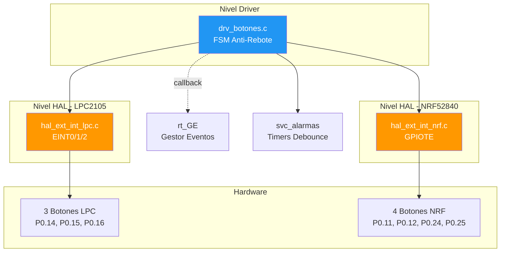
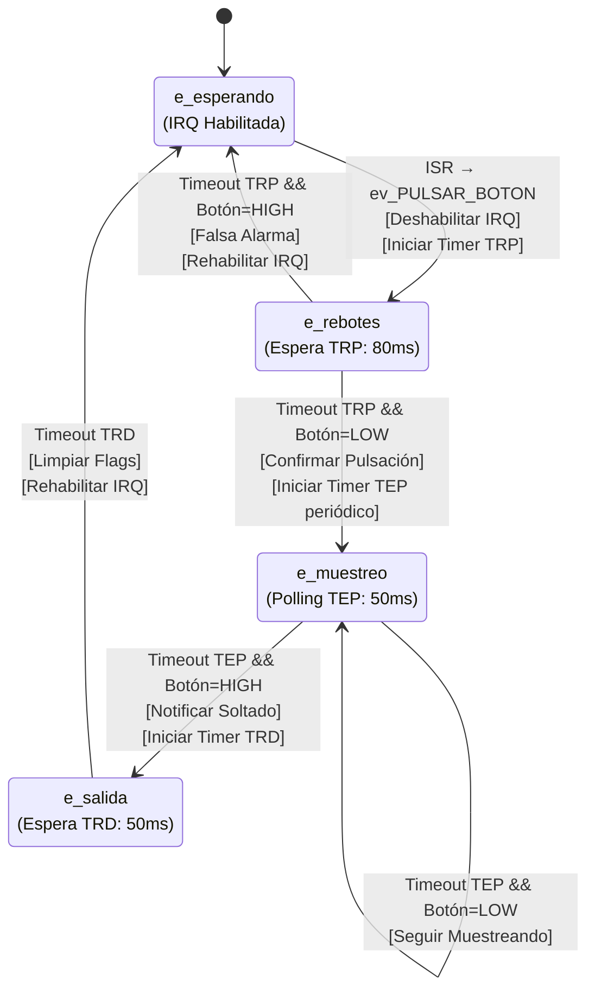
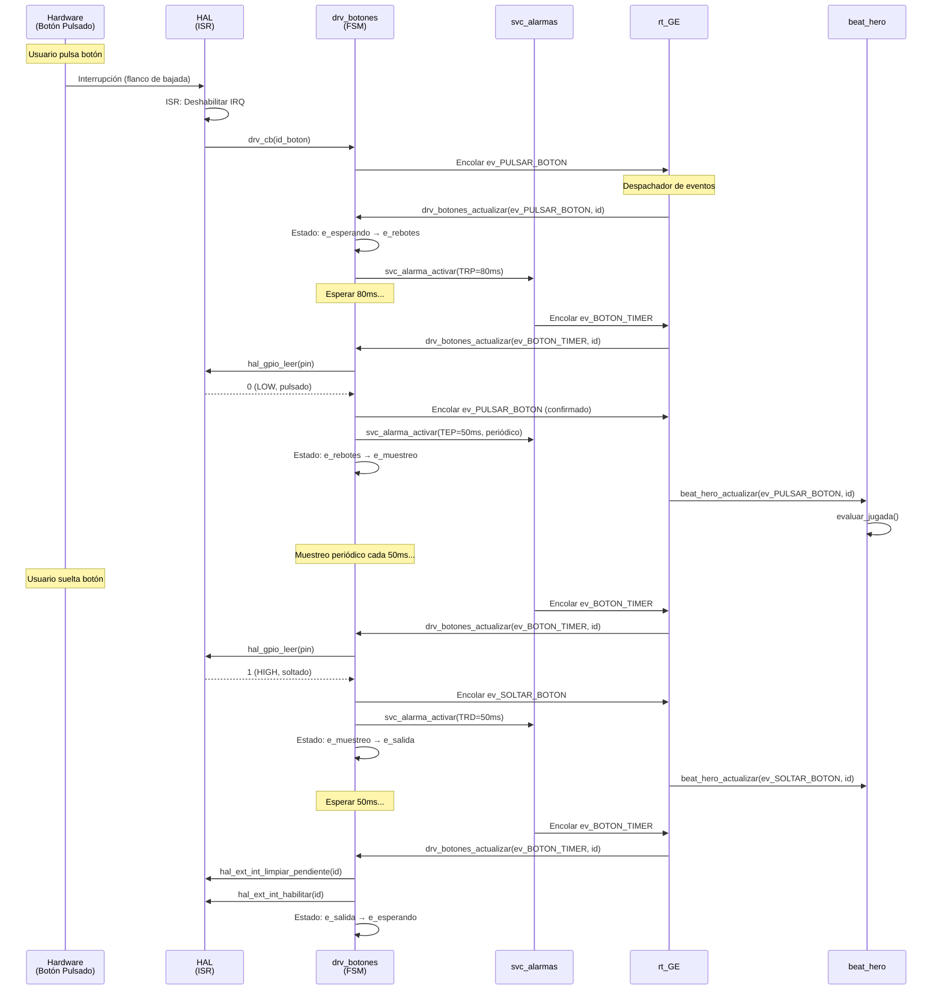

# 🔘 Funcionalidad: Manejo de Botones

## Introducción

El sistema de manejo de botones implementa una **máquina de estados** robusta para:
- Detección de pulsaciones mediante interrupciones externas de hardware
- Filtrado de rebotes mecánicos (debounce) por software
- Discriminación entre pulsación y liberación de botones
- Generación de eventos para el sistema de eventos

## Arquitectura de Componentes



## Archivos Implicados

| Archivo | Capa | Descripción |
|---------|------|-------------|
| `drv_botones.c` | Driver | FSM de anti-rebote y gestión de eventos |
| `drv_botones.h` | Driver | Interfaz pública del driver |
| `hal_ext_int_lpc.c` | HAL LPC | Interrupciones EINT para LPC2105 |
| `hal_ext_int_nrf.c` | HAL NRF | GPIOTE para NRF52840 |
| `hal_ext_int.h` | HAL | Interfaz común de HAL |

## Capa de Driver: `drv_botones.c`

### Máquina de Estados (FSM)



### Parámetros de Temporización

```c
#define TRP_MS 80   // Tiempo Rebote Pulsado: filtrado inicial
#define TEP_MS 50   // Tiempo Entre Pulsaciones: muestreo
#define TRD_MS 50   // Tiempo Rebote Despulsado: seguridad final
```

| Parámetro | Valor | Propósito |
|-----------|-------|-----------|
| **TRP_MS** | 80 ms | Espera tras interrupción para que rebotes mecánicos se estabilicen |
| **TEP_MS** | 50 ms | Periodo de muestreo para detectar liberación del botón |
| **TRD_MS** | 50 ms | Tiempo de seguridad antes de rehabilitar IRQ (evita rebotes al soltar) |

### Estados de la FSM

#### 1. **e_esperando** (Estado Inicial)
- **Característica**: IRQ de interrupción externa **habilitada**
- **Transición**: Flanco de bajada en pin → ISR dispara → `drv_cb()` → Evento `ev_PULSAR_BOTON`
- **Acción**: Deshabilitar IRQ, programar alarma TRP, cambiar a `e_rebotes`

#### 2. **e_rebotes** (Filtrado Inicial)
- **Característica**: Esperando 80ms para estabilización
- **Al Timeout**:
  - Si `hal_gpio_leer(pin) == 0` (LOW, pulsado) → Pulsación **válida** → `e_muestreo`
  - Si `hal_gpio_leer(pin) != 0` (HIGH, soltado) → **Falsa alarma** → `e_esperando`

#### 3. **e_muestreo** (Botón Pulsado Confirmado)
- **Característica**: Alarma **periódica** cada 50ms
- **Acción**: Leer estado del pin en cada timeout
- **Transición**: Detectar `pin == HIGH` → `ev_SOLTAR_BOTON` → `e_salida`

#### 4. **e_salida** (Tiempo de Seguridad)
- **Característica**: Espera 50ms antes de rehabilitar IRQ
- **Propósito**: Evitar que rebotes al soltar generen una nueva interrupción
- **Al Timeout**: Limpiar flags pendientes, rehabilitar IRQ → `e_esperando`

### Funciones Clave del Driver

#### `void drv_botones_iniciar(...)`

**Firma Completa**:
```c
void drv_botones_iniciar(
    void(*funcion_callback_app)(uint32_t, uint32_t),  // Callback a rt_FIFO_encolar
    EVENTO_T ev_pulsar,                                // ev_PULSAR_BOTON
    EVENTO_T ev_soltar,                                // ev_SOLTAR_BOTON
    EVENTO_T ev_tiempo                                 // ev_BOTON_TIMER
);
```

**Acciones**:
1. Guardar callbacks y eventos en variables estáticas
2. Inicializar array de estados: `s_estado_botones[i] = e_esperando`
3. Suscribirse al gestor de eventos:
   - `rt_GE_suscribir(ev_pulsar, 0, drv_botones_actualizar)`
   - `rt_GE_suscribir(ev_tiempo, 0, drv_botones_actualizar)`
4. Llamar a `hal_ext_int_iniciar(drv_cb)` → configurar hardware
5. Habilitar interrupciones: `hal_ext_int_habilitar(i)` para cada botón

#### `static void drv_cb(uint8_t id_boton)` (ISR Callback)

**Propósito**: Ejecutada desde el HAL cuando ocurre una interrupción de hardware

**Acciones**:
```c
void drv_cb(uint8_t id_boton) {
    hal_ext_int_deshabilitar(id_boton);                    // Deshabilitar IRQ
    drv_botones_isr_callback(ev_PULSAR_BOTON, id_boton);  // Encolar evento
}
```

**Nota Crítica**: Esta función se ejecuta en **contexto de interrupción** → debe ser rápida

#### `void drv_botones_actualizar(EVENTO_T evento, uint32_t auxiliar)` ⭐

**Propósito**: Máquina de estados principal (nivel de usuario, no ISR)

**Estructura**:
```c
void drv_botones_actualizar(EVENTO_T evento, uint32_t auxiliar) {
    uint8_t button_id = (uint8_t)auxiliar;
    
    if (evento == ev_PULSAR_BOTON) {
        // Caso 1: Pulsación inicial desde ISR
        if (s_estado_botones[button_id] == e_esperando) {
            // Programar alarma TRP (80ms, no periódica)
            uint32_t flags = svc_alarma_codificar(false, TRP_MS, button_id);
            svc_alarma_activar(flags, m_ev_retardo, button_id);
            s_estado_botones[button_id] = e_rebotes;
        }
        return;
    }
    
    // Caso 2: Timeouts de alarmas
    switch (s_estado_botones[button_id]) {
        case e_rebotes:
            // Leer pin y decidir si pulsación es válida
            if (hal_gpio_leer(s_pins_botones[button_id]) == 0) {
                drv_botones_isr_callback(m_ev_confirmado, button_id); // ev_PULSAR_BOTON validado
                // Iniciar muestreo periódico (TEP)
                uint32_t flags_tep = svc_alarma_codificar(true, TEP_MS, button_id);
                svc_alarma_activar(flags_tep, m_ev_retardo, button_id);
                s_estado_botones[button_id] = e_muestreo;
            } else {
                // Falsa alarma
                drv_botones_isr_callback(m_ev_soltado, button_id);
                hal_ext_int_limpiar_pendiente(button_id);
                hal_ext_int_habilitar(button_id);
                s_estado_botones[button_id] = e_esperando;
            }
            break;
        
        case e_muestreo:
            if (hal_gpio_leer(s_pins_botones[button_id]) != 0) {
                // Soltado detectado
                drv_botones_isr_callback(m_ev_soltado, button_id);
                svc_alarma_activar(0, m_ev_retardo, button_id); // Cancelar muestreo
                // Programar TRD (50ms)
                uint32_t flags_trd = svc_alarma_codificar(false, TRD_MS, button_id);
                svc_alarma_activar(flags_trd, m_ev_retardo, button_id);
                s_estado_botones[button_id] = e_salida;
            }
            break;
        
        case e_salida:
            hal_ext_int_limpiar_pendiente(button_id);
            hal_ext_int_habilitar(button_id);
            s_estado_botones[button_id] = e_esperando;
            break;
    }
}
```

## Capa HAL - LPC2105: `hal_ext_int_lpc.c`

### Configuración de Hardware

#### Pines y Canales EINTx

| Botón | Pin | Función EINT | Canal VIC | Slot VIC | Bit PINSEL |
|-------|-----|--------------|-----------|----------|------------|
| Button 1 | P0.14 | EINT1 | 15 | 2 | PINSEL0[29:28]=`10` |
| Button 2 | P0.15 | EINT2 | 16 | 3 | PINSEL0[31:30]=`10` |
| Button 3 | P0.16 | EINT0 | 14 | 4 | PINSEL1[1:0]=`01` |

#### Registros Clave del LPC2105

| Registro | Propósito |
|----------|-----------|
| `EXTINT` | Flag de interrupciones externas (escribir `1` para limpiar) |
| `EXTWAKE` | Habilitar wakeup desde Power Down |
| `PINSEL0/1` | Configuración de función alternativa de pines |
| `VICIntEnable` | Habilitar canal en VIC |
| `VICIntEnClr` | Deshabilitar canal en VIC |
| `VICVectCntlN` | Configurar slot del VIC (bit 5=Enable, bits[4:0]=Canal) |
| `VICVectAddrN` | Dirección del handler de interrupción |

### Funciones Principales del HAL LPC

#### `void hal_ext_int_iniciar(hal_ext_int_callback_t callback)`

**Acciones**:
1. Guardar puntero al callback del driver
2. Para cada botón en `s_buttons[]`:
   - Configurar `PINSEL` para función EINT
   - Limpiar `EXTINT`
   - Habilitar `EXTWAKE` (poder despertar del modo sleep)
   - Configurar VIC:
     - `VICVectCntlN = 0x20 | canal` (bit 5=Enable)
     - `VICVectAddrN = (unsigned long)handler`
     - `VICIntEnable = (1 << canal)`

**Ejemplo para EINT1 (P0.14)**:
```c
PINSEL0 = (PINSEL0 & ~(3UL << 28)) | (2UL << 28);  // Bits 29:28 = 10 (EINT1)
EXTINT = (1 << 1);                                  // Limpiar flag
EXTWAKE |= (1 << 1);                                // Habilitar wakeup
VICVectCntl2 = 0x20 | 15;                           // Slot 2, canal 15
VICVectAddr2 = (unsigned long)interrupcion_EINT_1;
VICIntEnable = (1 << 15);
```

#### ISRs (`__irq` handlers)

**Estructura Típica** (EINT1):
```c
__irq void interrupcion_EINT_1(void) {
    VICIntEnClr = (1 << 15);         // Deshabilitar IRQ inmediatamente
    EXTINT = (1 << 1);                // Limpiar flag de interrupción
    
    if (f_callback_drv) {
        uint8_t id_boton = cast_boton_pin(PIN_EINT_1);
        if (id_boton != 0x4) {
            f_callback_drv(id_boton);  // Llamar a drv_cb()
        }
    }
    
    VICVectAddr = 0;                  // Señal de fin de ISR al VIC
}
```

**Notas Importantes**:
- `__irq`: Atributo del compilador ARM para guardar/restaurar contexto
- Se deshabilita la IRQ **dentro de la ISR** para evitar rebotes repetitivos
- `VICVectAddr = 0`: Notificar al VIC que la ISR terminó

#### `void hal_ext_int_habilitar(uint32_t id_linea)`

**Acciones**:
1. Obtener pin: `pin = s_buttons[id_linea]`
2. Configurar `PINSEL` para función EINT
3. Limpiar `EXTINT` (flags pendientes)
4. Habilitar en VIC: `VICIntEnable = (1 << canal)`

#### `void hal_ext_int_deshabilitar(uint32_t id_linea)`

**Acciones**:
1. Deshabilitar en VIC: `VICIntEnClr = (1 << canal)`
2. Limpiar `EXTINT`
3. Revertir `PINSEL` a GPIO (función `00`)

#### `void hal_ext_int_limpiar_pendiente(uint32_t id_linea)`

**Acción**:
```c
uint8_t eint = pin_entero(pin);  // Obtener número EINT (0, 1, o 2)
EXTINT = (1 << eint);             // Escribir 1 para limpiar
```

## Capa HAL - NRF52840: `hal_ext_int_nrf.c`

### Configuración de Hardware

#### Pines GPIO (NRF52840 DK)

| Botón | Pin | Puerto |
|-------|-----|--------|
| Button 1 | P0.11 | Port 0, Pin 11 |
| Button 2 | P0.12 | Port 0, Pin 12 |
| Button 3 | P0.24 | Port 0, Pin 24 |
| Button 4 | P0.25 | Port 0, Pin 25 |

**Macro de Mapeo**:
```c
#define NRF_GPIO_PIN_MAP(port, pin) (((port) << 5) | ((pin) & 0x1F))
```

#### Arquitectura GPIOTE (GPIO Tasks and Events)

El NRF usa **GPIOTE** (no interrupciones EXTI dedicadas como el LPC):
- **EVENT_PORT**: Evento generado por cambio en cualquier pin configurado con `SENSE`
- **LATCH**: Registro que indica qué pines generaron el evento
- **PIN_CNF**: Configuración individual de cada pin (DIR, INPUT, PULL, SENSE)

### Funciones Principales del HAL NRF

#### `void hal_ext_int_iniciar(hal_ext_int_callback_t callback)`

**Acciones**:
1. Guardar callback
2. Para cada pin en `g_hal_ext_int_pines[]`:
   - Configurar `NRF_P0->PIN_CNF[pin]`:
     ```c
     PIN_CNF_DEF = 
         (GPIO_PIN_CNF_DIR_Input << GPIO_PIN_CNF_DIR_Pos) |
         (GPIO_PIN_CNF_INPUT_Connect << GPIO_PIN_CNF_INPUT_Pos) |
         (GPIO_PIN_CNF_PULL_Pullup << GPIO_PIN_CNF_PULL_Pos) |
         (GPIO_PIN_CNF_SENSE_Disabled << GPIO_PIN_CNF_SENSE_Pos);
     ```
3. Habilitar interrupción PORT:
   ```c
   NRF_GPIOTE->INTENSET = GPIOTE_INTENSET_PORT_Msk;
   NVIC_ClearPendingIRQ(GPIOTE_IRQn);
   NVIC_EnableIRQ(GPIOTE_IRQn);
   ```

#### `void hal_ext_int_habilitar(uint32_t id_linea)`

**Acción**: Cambiar campo `SENSE` a `Low` (detectar nivel bajo):
```c
uint32_t cnf = NRF_P0->PIN_CNF[pin];
cnf &= ~GPIO_PIN_CNF_SENSE_Msk;
cnf |= (GPIO_PIN_CNF_SENSE_Low << GPIO_PIN_CNF_SENSE_Pos);
NRF_P0->PIN_CNF[pin] = cnf;
```

#### `void hal_ext_int_deshabilitar(uint32_t id_linea)`

**Acción**: Cambiar campo `SENSE` a `Disabled`:
```c
cnf &= ~GPIO_PIN_CNF_SENSE_Msk;
cnf |= (GPIO_PIN_CNF_SENSE_Disabled << GPIO_PIN_CNF_SENSE_Pos);
NRF_P0->PIN_CNF[pin] = cnf;
```

#### `void hal_ext_int_limpiar_pendiente(uint32_t id_linea)`

**Acción**: Escribir en `LATCH` para limpiar el flag:
```c
NRF_P0->LATCH = (1UL << pin);
```

**Nota**: En NRF, el registro `LATCH` se limpia escribiendo `1` en el bit correspondiente

#### `void GPIOTE_IRQHandler(void)` (ISR)

**Estructura**:
```c
void GPIOTE_IRQHandler(void) {
    if (NRF_GPIOTE->EVENTS_PORT) {
        NRF_GPIOTE->EVENTS_PORT = 0;           // Limpiar evento
        uint32_t latch = NRF_P0->LATCH;        // Leer qué pines cambiaron
        
        for (uint8_t i = 0; i < g_hal_ext_int_num_pines; i++) {
            uint32_t pin = g_hal_ext_int_pines[i];
            if (pin < 32 && (latch & (1UL << pin))) {
                NRF_P0->LATCH = (1UL << pin);  // Limpiar latch
                if (s_hal_callback)
                    s_hal_callback(i);          // Llamar a drv_cb()
            }
        }
    }
}
```

**Diferencia Clave con LPC**:
- NRF usa un solo handler para TODOS los pines
- Debe iterar y verificar cuál pin disparó la interrupción
- LPC tiene handlers individuales por EINT

## Flujo de Ejecución Completo



## Dependencias

### Módulos Requeridos

1. **hal_ext_int.h**: Interfaz de interrupciones externas
2. **hal_gpio.h**: Lectura de estado de pines
3. **svc_alarmas.c**: Timers para debounce
4. **rt_GE.c**: Sistema de eventos (suscripción y callbacks)
5. **drv_tiempo.h**: Tipos de tiempo (no usado directamente, pero sí por alarmas)

### Eventos Generados

| Evento | Momento | Propósito |
|--------|---------|-----------|
| `ev_PULSAR_BOTON` | Pulsación confirmada tras TRP | Notificar a la aplicación de input válido |
| `ev_SOLTAR_BOTON` | Liberación detectada en muestreo | Permitir cancelaciones y gestión de "mantener pulsado" |

## Configuración Hardware Específica

### LPC2105

```c
// En board_lpc.h
#define BUTTONS_NUMBER 3
#define BUTTON_1 (INT_EXT1)  // P0.14, EINT1
#define BUTTON_2 (INT_EXT2)  // P0.15, EINT2
#define BUTTON_3 (INT_EXT3)  // P0.16, EINT0
#define BUTTONS_ACTIVE_STATE 1  // Activo en HIGH (pull-up)
```

### NRF52840 DK

```c
// En board_nrf52840dk.h
#define BUTTONS_NUMBER 4
#define BUTTON_1 NRF_GPIO_PIN_MAP(0,11)  // P0.11
#define BUTTON_2 NRF_GPIO_PIN_MAP(0,12)  // P0.12
#define BUTTON_3 NRF_GPIO_PIN_MAP(0,24)  // P0.24
#define BUTTON_4 NRF_GPIO_PIN_MAP(0,25)  // P0.25
#define BUTTONS_ACTIVE_STATE 0  // Activo en LOW (pull-up)
```

**Diferencia Clave**: 
- LPC: Botones generan HIGH cuando pulsados
- NRF: Botones generan LOW cuando pulsados (lógica inversa)

## Observaciones Técnicas

### 1. **Robustez del Debounce**
- Filtrado de 3 etapas: TRP (estabilización) → TEP (muestreo) → TRD (seguridad)
- Lectura explícita del pin en lugar de confiar solo en interrupciones
- Falsa alarma recuperable sin afectar estado del sistema

### 2. **Gestión de Interrupciones**
- Las IRQs se **deshabilitan dentro de la ISR** (evitar flood de interrupciones por rebotes)
- Rehabilitación solo tras esperar TRD (tiempo de seguridad)
- Limpieza explícita de flags pendientes antes de rehabilitar

### 3. **Portabilidad**
- `drv_botones.c` es **100% portable** (no conoce LPC ni NRF)
- Diferencias de hardware encapsuladas en HAL
- Uso de external variables en NRF (`g_hal_ext_int_pines[]`) definidas en `main.c`

### 4. **Limitaciones Conocidas**
- **LPC P0.16 (EINT0)**: En algunas placas puede generar resets esporádicos (problema hardware conocido)
- **Solución Workaround**: Usar solo EINT1 y EINT2 si hay problemas

### 5. **Optimizaciones**
- Estados por botón permiten multi-pulsación simultánea
- Alarmas con ID único por botón (`button_id` como `auxData`)
- FSM stateless: toda la lógica en `drv_botones_actualizar()`

---

[← Anterior: Juego](01_JUEGO.md) | [Volver al índice](00_INDICE.md) | [Siguiente: Tiempo →](03_TIEMPO.md)
