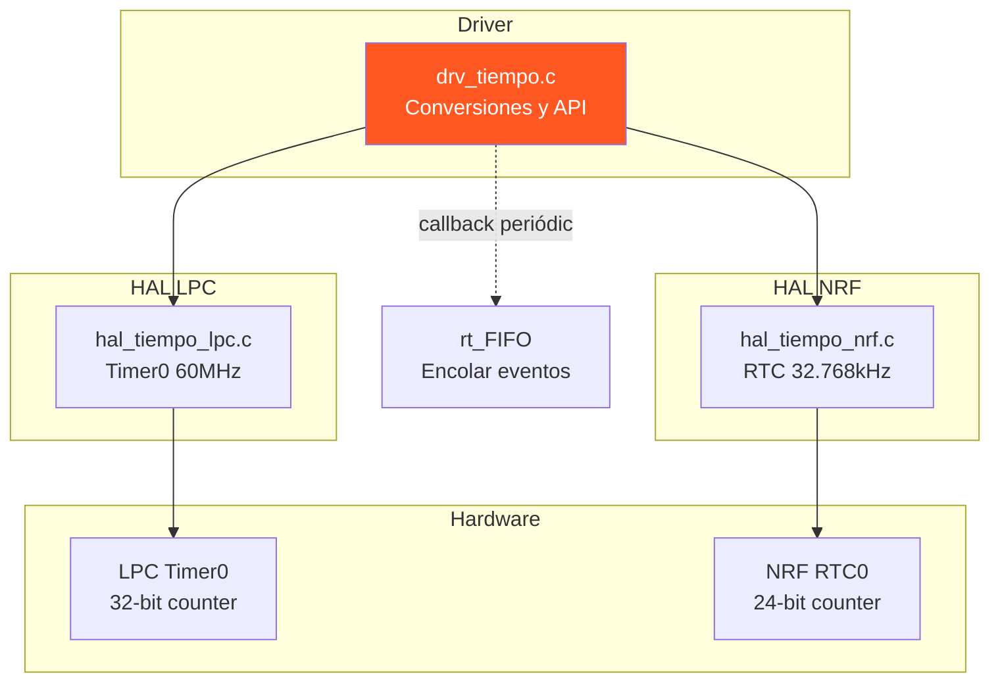

# ⏱️ Funcionalidad: Gestión de Tiempo

## Introducción

El sistema de gestión de tiempo proporciona:
- **Base de tiempos** del sistema en microsegundos (64 bits)
- **Conversiones** a milisegundos
- **Esperas activas** con wraparound-safe
- **Timers periódicos** para generar eventos
- **Abstracción** entre hardware de LPC (Timer0) y NRF (RTC)

## Arquitectura de Componentes



## Archivos Implicados

| Archivo | Capa | Descripción |
|---------|------|-------------|
| `drv_tiempo.c` | Driver | Conversiones y API de alto nivel |
| `drv_tiempo.h` | Driver | Tipos `Tiempo_us_t`, `Tiempo_ms_t` |
| `hal_tiempo_lpc.c` | HAL LPC | Timer0 con prescaler |
| `hal_tiempo_nrf.c` | HAL NRF | RTC con software overflow |
| `hal_tiempo.h` | HAL | Interfaz común |

## Capa de Driver: `drv_tiempo.c`

### Tipos de Datos

```c
typedef uint64_t Tiempo_us_t;  // Microsegundos (64 bits)
typedef uint32_t Tiempo_ms_t;  // Milisegundos (32 bits)
```

**Justificación**:
- 64 bits para `us` → permite ~584,542 años sin wraparound
- 32 bits para `ms` → permite ~49.7 días sin wraparound (suficiente para embebidos)

### Estructura de Información HAL

```c
typedef struct {
    uint32_t ticks_per_us;   // Ticks de hardware por microsegundo
    uint32_t freq_hz;         // Frecuencia del timer en Hz
} hal_tiempo_info_t;
```

**Ejemplos** de valores:
- **LPC**: `ticks_per_us = 60` (Timer a 60 MHz)
- **NRF**: `ticks_per_us ≈ 0.032768` (RTC a 32.768 kHz)

### Funciones del Driver

#### `bool drv_tiempo_iniciar(void)`

**Acciones**:
```c
bool drv_tiempo_iniciar(void) {
    hal_tiempo_iniciar_tick(&s_hal_info);  // Configurar hardware
    s_iniciado = true;
    return true;
}
```

- Llama al HAL para configurar timer/RTC
- Rellena `s_hal_info` con `ticks_per_us` y `freq_hz`
- Marca el sistema como inicializado

#### `Tiempo_us_t drv_tiempo_actual_us(void)`

**Algoritmo**:
```c
Tiempo_us_t drv_tiempo_actual_us(void) {
    if (!s_iniciado) return 0;
    
    uint64_t ticks = hal_tiempo_actual_tick64();  // Leer contador
    uint64_t us = ticks / (uint64_t)s_hal_info.ticks_per_us;
    return (Tiempo_us_t)us;
}
```

**Clave**: División por `ticks_per_us` para normalizar diferentes frecuencias de hardware

#### `Tiempo_ms_t drv_tiempo_actual_ms(void)`

**Implementación**:
```c
Tiempo_ms_t drv_tiempo_actual_ms(void) {
    Tiempo_us_t us = drv_tiempo_actual_us();
    return (Tiempo_ms_t)(us / 1000u);
}
```

**Nota**: Pérdida de precisión al dividir (1ms = 1000µs)

#### `void drv_tiempo_esperar_ms(Tiempo_ms_t ms)` ⚠️

**Implementación**:
```c
void drv_tiempo_esperar_ms(Tiempo_ms_t ms) {
    Tiempo_ms_t inicio = drv_tiempo_actual_ms();
    Tiempo_ms_t deadline = inicio + ms;
    
    Tiempo_ms_t ahora;
    do {
        ahora = drv_tiempo_actual_ms();
    } while ((Tiempo_ms_t)(ahora - deadline) > 0 && ahora != deadline);
}
```

**Características**:
- **Espera activa** (busy-wait) → consume CPU
- **Wraparound-safe**: usa aritmética modular `(ahora - deadline)`
- **No apropiado** para delays largos (usar alarmas en su lugar)

#### `void drv_tiempo_periodico_ms(...)` ⭐

```c
void drv_tiempo_periodico_ms(
    Tiempo_ms_t ms,                  // Periodo
    void(*funcion_callback_app)(),   // Callback (normalmente rt_FIFO_encolar)
    uint32_t ID_evento               // ID del evento a generar
);
```

**Propósito**: Configurar interrupción periódica que ejecuta callback en cada tick

**Flujo**:
1. Convertir `ms` → `ticks`: `periodo_en_tick = ms * (ticks_per_us * 1000)`
2. Guardar callback y parámetros en estáticas
3. Llamar a `hal_tiempo_reloj_periodico_tick(periodo_en_tick, wrapper)`

**Wrapper Interno**:
```c
void drv_funcion_callback_app() {
    if (s_funcion != NULL) {
        ((f_callback_fifo_t)s_funcion)(s_parametro, 0);
    }
}
```

**Nota Crítica**: El wrapper castea la función para garantizar que se pasen 2 argumentos (compatible con `rt_FIFO_encolar`), evitando corrupción de pila.

## Capa HAL - LPC2105

### Configuración de Hardware

#### Timer0 del LPC2105

| Parámetro | Valor | Descripción |
|-----------|-------|-------------|
| **Frecuencia Base** | 60 MHz | PCLK (Peripheral Clock) |
| **Prescaler** | Configurable | Dividir frecuencia base |
| **Contador** | 32 bits | Timer Counter (TC) |
| **Match Registers** | MR0-MR3 | Generar interrupciones |

#### Registros Clave

```c
T0TCR    // Timer Control Register (Start/Stop/Reset)
T0TC     // Timer Counter (valor actual)
T0PR     // Prescale Register
T0PC     // Prescale Counter
T0MR0    // Match Register 0
T0MCR    // Match Control Register
```

### Implementación Típica

```c
void hal_tiempo_iniciar_tick(hal_tiempo_info_t *info) {
    // Configurar PCLK para Timer0 (60 MHz)
    PCLKSEL0 = (PCLKSEL0 & ~(3 << 2)) | (1 << 2);
    
    // Resetear timer
    T0TCR = 0x02;  // Reset
    T0TCR = 0x00;  // Liberar reset
    
    // Configurar prescaler (ejemplo: sin prescaler)
    T0PR = 0;
    
    // Iniciar timer
    T0TCR = 0x01;  // Enable
    
    // Llenar info
    info->freq_hz = 60000000;
    info->ticks_per_us = 60;
}

uint64_t hal_tiempo_actual_tick64(void) {
    static uint32_t overflows = 0;
    static uint32_t last_tc = 0;
    
    uint32_t tc = T0TC;
    if (tc < last_tc) {
        overflows++;  // Detectar wraparound
    }
    last_tc = tc;
    
    return ((uint64_t)overflows << 32) | tc;
}

void hal_tiempo_reloj_periodico_tick(uint32_t periodo, void(*callback)()) {
    T0MR0 = periodo;
    T0MCR |= (1 << 0) | (1 << 1);  // Interrupt on MR0, Reset on MR0
    
    // Configurar VIC para Timer0 (canal 4)
    VICVectAddr5 = (unsigned long)callback;
    VICVectCntl5 = 0x20 | 4;
    VICIntEnable = (1 << 4);
}
```

## Capa HAL - NRF52840

### Configuración de Hardware

#### RTC (Real Time Counter)

| Parámetro | Valor | Descripción |
|-----------|-------|-------------|
| **Frecuencia** | 32.768 kHz | LFCLK (Low Frequency Clock) |
| **Contador** | 24 bits | `COUNTER` register |
| **Prescaler** | 12 bits | División adicional |
| **Compare Registers** | CC[0-3] | Match para interrupciones |

**Cálculo**:
```
Frecuencia_efectiva = 32768 / (PRESCALER + 1)
Periodo_tick = 1 / Frecuencia_efectiva
```

#### Extensión a 64 bits (Software Overflow)

Dado que el contador es de 24 bits, el HAL debe detectar overflows:

```c
uint64_t hal_tiempo_actual_tick64(void) {
    static uint32_t overflows = 0;
    static uint32_t last_counter = 0;
    
    uint32_t counter = NRF_RTC0->COUNTER;
    if (counter < last_counter) {
        overflows++;  // Wraparound detectado
    }
    last_counter = counter;
    
    return ((uint64_t)overflows << 24) | counter;
}
```

**Nota**: El RTC puede generar interrupción de overflow para automatizar esto.

### Implementación Típica

```c
void hal_tiempo_iniciar_tick(hal_tiempo_info_t *info) {
    // Iniciar LFCLK (32.768 kHz)
    NRF_CLOCK->LFCLKSRC = CLOCK_LFCLKSRC_SRC_Xtal;
    NRF_CLOCK->EVENTS_LFCLKSTARTED = 0;
    NRF_CLOCK->TASKS_LFCLKSTART = 1;
    while (!NRF_CLOCK->EVENTS_LFCLKSTARTED);
    
    // Configurar RTC0
    NRF_RTC0->PRESCALER = 0;  // Sin división adicional
    NRF_RTC0->TASKS_START = 1;
    
    info->freq_hz = 32768;
    info->ticks_per_us = 0;  // Se calcula: 32768 / 1000000 ≈ 0.032768
}

void hal_tiempo_reloj_periodico_tick(uint32_t periodo, void(*callback)()) {
    NRF_RTC0->CC[0] = periodo;
    NRF_RTC0->INTENSET = RTC_INTENSET_COMPARE0_Msk;
    NRF_RTC0->EVENTS_COMPARE[0] = 0;
    
    NVIC_EnableIRQ(RTC0_IRQn);
    // Registrar callback (manejo específico de implementación)
}

void RTC0_IRQHandler(void) {
    if (NRF_RTC0->EVENTS_COMPARE[0]) {
        NRF_RTC0->EVENTS_COMPARE[0] = 0;
        NRF_RTC0->CC[0] += periodo;  // Recalcular próximo match
        if (callback) callback();
    }
}
```

## Comparación LPC vs NRF

| Aspecto | LPC2105 | NRF52840 |
|---------|---------|----------|
| **Timer** | Timer0 (High Speed) | RTC (Low Power) |
| **Frecuencia** | 60 MHz | 32.768 kHz |
| **Precisión (µs)** | ~0.017 µs (60 ticks/µs) | ~30.5 µs (0.0328 ticks/µs) |
| **Bits** | 32 | 24 |
| **Power** | Alta | Muy baja (LFCLK) |

**Implicaciones**:
- **LPC**: Mayor precisión, ideal para timing crítico
- **NRF**: Menor consumo, suficiente para la mayoría de aplicaciones

## Dependencias

### Usada Por
- **svc_alarmas.c**: Usa `drv_tiempo_periodico_ms()` para tick de 1ms
- **beat_hero.c**: Usa `drv_tiempo_actual_us()` para medir reacción del jugador
- **drv_botones.c** (indirecto): A través de `svc_alarmas`
- **test.c**: verificación de timings

### Requiere
- **hal_tiempo.h**: Interfaz HAL
- **hal_tiempo_lpc.c / hal_tiempo_nrf.c**: Implementaciones de hardware

## Observaciones Técnicas

### 1. **Precaución con Esperas Activas**
```c
drv_tiempo_esperar_ms(1000);  // ❌ Bloquea CPU durante 1 segundo
```
**Mejor**: Usar `svc_alarmas` para delays no bloqueantes

### 2. **Aritmética Wraparound-Safe**
```c
// ✅ CORRECTO
while ((Tiempo_ms_t)(ahora - deadline) > 0);

// ❌ INCORRECTO (falla en wraparound)
while (ahora < deadline);
```

### 3. **Conversión µs → ms**
```c
Tiempo_ms_t ms = (Tiempo_ms_t)(us / 1000u);
```
**Pérdida de precisión**: 999 µs → 0 ms

### 4. **Timer Periódico y Callbacks**

El timer periódico ejecuta callback **desde contexto de interrupción**. El driver usa un wrapper para:
- Garantizar firma de función correcta
- Pasar parámetros esperados por `rt_FIFO_encolar`
- Evitar stack corruption

### 5. **Detección de Overflow (64 bits)**

Ambos HALs extienden contadores de 24/32 bits a 64 bits mediante:
```c
if (contador_actual < ultimo_contador) {
    contador_overflows++;
}
```

**Riesgo**: Si no se lee con suficiente frecuencia, se pueden perder overflows.

---

[← Anterior: Botones](02_BOTONES.md) | [Volver al índice](00_INDICE.md) | [Siguiente: Alarmas →](04_ALARMAS.md)
