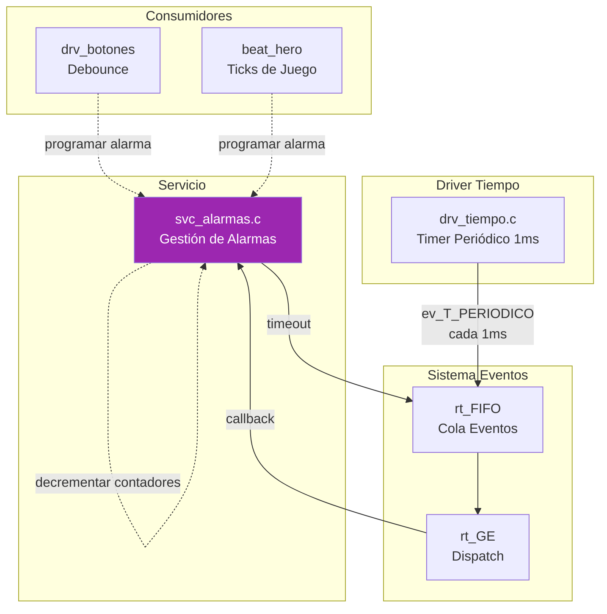
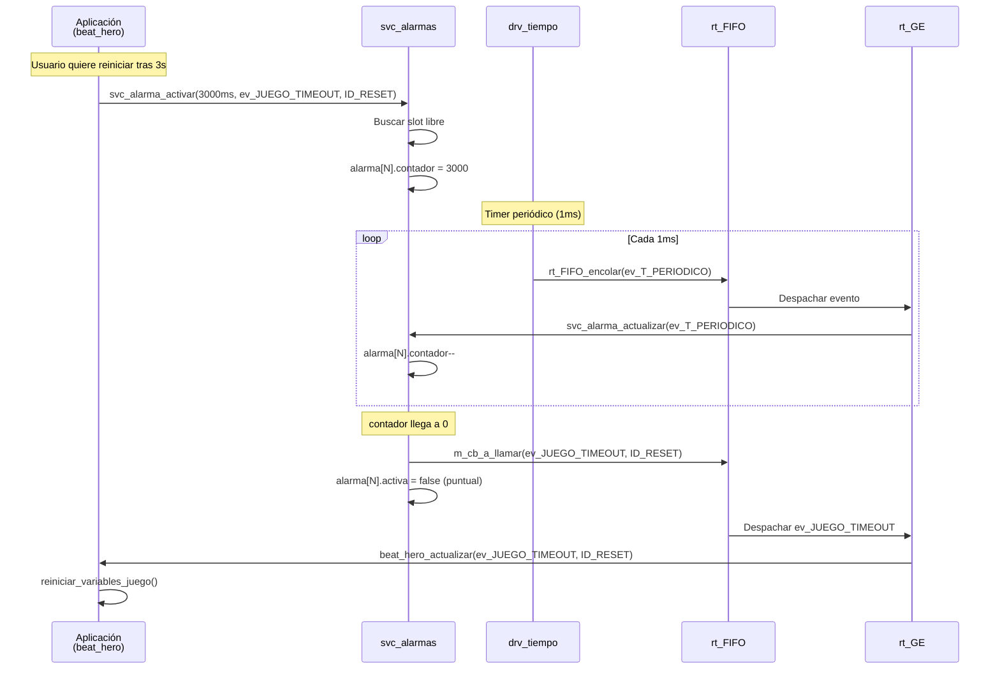

# ⏰ Funcionalidad: Sistema de Alarmas

## Introducción

El sistema de alarmas (`svc_alarmas`) proporciona **temporizadores programables** de alto nivel que permiten:
- Ejecutar callbacks tras un retardo específico
- Alarmas **periódicas** (se relanzan automáticamente)
- Alarmas **puntuales** (se ejecutan una sola vez)
- Gestión de **múltiples alarmas simultáneas** (hasta 8)
- **Reprogramación** y **cancelación** dinámica

## Arquitectura de Componentes



## Archivos Implicados

| Archivo | Capa | Descripción |
|---------|------|-------------|
| `svc_alarmas.c` | Servicio | Lógica de gestión de alarmas |
| `svc_alarmas.h` | Servicio | Interfaz pública |

**Nota**: Este módulo **NO tiene HAL** porque trabaja sobre `drv_tiempo` (ya portado).

## Estructura de Datos

### Alarma Individual

```c
typedef struct {
    bool activa;          // ¿Está la alarma activa?
    bool periodica;       // ¿Se relanza automáticamente?
    uint32_t retardo_ms;  // Periodo/Retardo en milisegundos
    uint32_t contador;    // Cuenta regresiva actual (decrementado cada 1ms)
    EVENTO_T ID_evento;   // Evento a generar al timeout
    uint32_t auxData;     // Datos auxiliares para el evento
} Alarma_t;
```

### Array de Alarmas

```c
#define svc_ALARMAS_MAX 8
static Alarma_t m_alarmas[svc_ALARMAS_MAX];
```

**Capacidad**: 8 alarmas simultáneas (ajustable cambiando la macro)

### Identificación de Alarmas

Cada alarma se identifica por la tupla `(ID_evento, auxData)`:
- Permite tener múltiples alarmas **del mismo evento** pero con datos diferentes
- Ejemplo: 4 botones pueden tener 4 alarmas de `ev_BOTON_TIMER` con `auxData = button_id`

## Codificación de Flags de Alarma

### Estructura de 32 bits

```c
#define MASK_RETARDO    0x00FFFFFF  // Bits 0-23: Retardo (24 bits → max 16,777,215 ms ≈ 4.66 horas)
#define MASK_FLAGS      0x7F000000  // Bits 24-30: Flags de usuario
#define MASK_PERIODICA  0x80000000  // Bit 31: Periódica (1) o Puntual (0)
```

| Bits | Campo | Descripción |
|------|-------|-------------|
| 0-23 | `retardo_ms` | Retardo en milisegundos (16.7M ms máximo) |
| 24-30 | `flags` | Flags de usuario (disponibles para identificación extra) |
| 31 | `periodica` | 1 = Periódica, 0 = Puntual |

### Funciones de Codificación

#### `uint32_t svc_alarma_codificar(bool periodico, uint32_t retardo_ms, uint8_t flags)`

**Propósito**: Crear valor de 32 bits con todos los parámetros empaquetados

**Implementación**:
```c
uint32_t svc_alarma_codificar(bool periodico, uint32_t retardo_ms, uint8_t flags) {
    uint32_t alarma_flags = 0;
    alarma_flags |= (retardo_ms & MASK_RETARDO);          // Bits 0-23
    alarma_flags |= ((uint32_t)flags << 24) & MASK_FLAGS; // Bits 24-30
    if (periodico) {
        alarma_flags |= MASK_PERIODICA;                   // Bit 31
    }
    return alarma_flags;
}
```

**Ejemplo de Uso**:
```c
// Alarma puntual de 500ms, flag=5
uint32_t flags = svc_alarma_codificar(false, 500, 5);

// Alarma periódica de 50ms, flag=button_id
uint32_t flags = svc_alarma_codificar(true, 50, button_id);
```

## Funciones Principales

### `void svc_alarma_iniciar(...)`

```c
void svc_alarma_iniciar(
    uint32_t monitor_overflow,                     // ID de monitor para overflow
    void(*funcion_callback_app)(uint32_t, uint32_t),  // rt_FIFO_encolar
    EVENTO_T ev_a_notificar                        // ev_T_PERIODICO
);
```

**Acciones**:
1. Guardar callback y evento base
2. Inicializar array: `m_alarmas[i].activa = false`
3. Suscribirse a `ev_a_notificar`: `rt_GE_suscribir(ev_a_notificar, 0, svc_alarma_actualizar)`
4. Programar tick periódico: `drv_tiempo_periodico_ms(1, funcion_callback_app, ev_a_notificar)`

**Resultado**: Cada 1ms se generará `ev_T_PERIODICO` → `svc_alarma_actualizar()` decrementará contadores

### `void svc_alarma_activar(uint32_t alarma_flags, EVENTO_T ID_evento, uint32_t auxData)` ⭐

**Propósito**: Programar, reprogramar o cancelar una alarma

**Casos de Uso**:

#### Caso 1: Cancelar Alarma
```c
svc_alarma_activar(0, ev_JUEGO_TIMEOUT, ID_RESET);  // flags = 0 → cancelar
```

**Acción**: Buscar alarma con `(ID_evento, auxData)` y desactivarla

#### Caso 2: Programar Nueva Alarma
```c
uint32_t flags = svc_alarma_codificar(false, 3000, ID_RESET);
svc_alarma_activar(flags, ev_JUEGO_TIMEOUT, ID_RESET);
```

**Acción**:
1. Buscar si ya existe `(ID_evento, auxData)`
2. Si **no** existe → buscar slot libre
3. Configurar alarma:
   ```c
   alarma->activa = true;
   alarma->periodica = decodificar_periodica(flags);
   alarma->retardo_ms = decodificar_retardo(flags);
   alarma->contador = alarma->retardo_ms;
   alarma->ID_evento = ID_evento;
   alarma->auxData = auxData;
   ```

#### Caso 3: Reprogramar Alarma Existente
```c
// Primera llamada
svc_alarma_activar(flags1, ev_X, 1);

// Segunda llamada (mismo evento/auxData)
svc_alarma_activar(flags2, ev_X, 1);  // Reusa el slot
```

**Acción**: Si la alarma ya existe, simplemente se reconfigura (no se crea nueva entrada)

### `void svc_alarma_actualizar(EVENTO_T evento, uint32_t aux)` ⭐

**Propósito**: Callback del gestor de eventos (ejecutado cada 1ms)

**Algoritmo**:
```c
void svc_alarma_actualizar(EVENTO_T evento, uint32_t aux) {
    if (evento != m_ev_a_notificar) return;  // Solo procesar ev_T_PERIODICO
    
    for (int i = 0; i < svc_ALARMAS_MAX; i++) {
        if (m_alarmas[i].activa) {
            if (m_alarmas[i].contador > 0) {
                m_alarmas[i].contador--;  // Decrementar
            }
            
            if (m_alarmas[i].contador == 0) {
                // TIMEOUT: Ejecutar callback
                if (m_cb_a_llamar) {
                    m_cb_a_llamar(m_alarmas[i].ID_evento, m_alarmas[i].auxData);
                }
                
                if (m_alarmas[i].periodica) {
                    // Relanzar alarma periódica
                    m_alarmas[i].contador = m_alarmas[i].retardo_ms;
                } else {
                    // Alarma puntual → desactivar
                    m_alarmas[i].activa = false;
                }
            }
        }
    }
}
```

**Características Clave**:
- Itera sobre **todas** las alarmas activas
- Decrementa contadores en **cada tick** (1ms)
- Al llegar a 0 → ejecuta callback
- Alarmas periódicas se **relanzan automáticamente**
- Alarmas puntuales se **desactivan**

## Ejemplos de Uso

### Ejemplo 1: Timer Puntual (Timeout de Reinicio)

```c
// En beat_hero.c, al pulsar botón de reinicio
uint32_t flags = svc_alarma_codificar(false, 3000, ID_ALARMA_RESET);
svc_alarma_activar(flags, ev_JUEGO_TIMEOUT, ID_ALARMA_RESET);

// Si el usuario suelta el botón antes de 3s
svc_alarma_activar(0, ev_JUEGO_TIMEOUT, ID_ALARMA_RESET);  // Cancelar
```

### Ejemplo 2: Timer Periódico (Muestreo de Botón)

```c
// En drv_botones.c, al confirmar pulsación
uint32_t flags = svc_alarma_codificar(true, 50, button_id);
svc_alarma_activar(flags, ev_BOTON_TIMER, button_id);

// Cada 50ms se generará ev_BOTON_TIMER con auxData=button_id
// Hasta que se cancele:
svc_alarma_activar(0, ev_BOTON_TIMER, button_id);
```

### Ejemplo 3: Alarmas Múltiples (4 Botones)

```c
// Cada botón puede tener su propia alarma
for (int i = 0; i < 4; i++) {
    uint32_t flags = svc_alarma_codificar(true, 50, i);
    svc_alarma_activar(flags, ev_BOTON_TIMER, i);
}
// Resultado: 4 alarmas activas simultáneamente
```

## Diagrama de Flujo de Ejecución



## Gestión de Recursos

### Detección de Overflow

Si no hay slots libres al crear una alarma:

```c
if (alarma == NULL) {
    if (g_M_overflow_monitor_id) {
        drv_monitor_marcar(g_M_overflow_monitor_id);  // Señalizar error
    }
    while(1);  // Bloqueo del sistema (error crítico)
}
```

**Estrategia**:
- Marcar pin de monitor (visible en osciloscopio/debugger)
- Bloquear sistema (evitar corrupción de datos)

### Debug: Variables de Monitorización

```c
#ifdef DEBUG
volatile uint32_t dbg_alarmas_activas = 0;     // Número actual de alarmas activas
volatile uint32_t dbg_alarmas_max_uso = 0;      // Máximo histórico de alarmas
#endif
```

**Uso**: Inspeccionar en debugger para optimizar `svc_ALARMAS_MAX`

## Configuración Hardware

**No aplica** - Este módulo es puramente software y portable.

### Parámetros Configurables

```c
#define svc_ALARMAS_MAX 8         // Número máximo de alarmas simultáneas
#define tiempo_periodico 1        // Periodo de tick en ms
```

**Nota**: Reducir `tiempo_periodico` mejora resolución pero aumenta overhead de ISR

## Dependencias

### Requiere
1. **drv_tiempo.c**: Para `drv_tiempo_periodico_ms()`
2. **rt_GE.c**: Para suscripción a eventos (`rt_GE_suscribir`)  
3. **rt_FIFO.c**: Para encolar eventos de timeout (callback)

### Usado Por
1. **drv_botones.c**: Timers de debounce (TRP, TEP, TRD)
2. **beat_hero.c**: Ticks de juego, timeouts de reinicio, demo
3. **drv_consumo.c** (potencialmente): Timers de inactividad

## Observaciones Técnicas

### 1. **Resolución vs Overhead**
- Tick de 1ms → buena resolución para la mayoría de casos
- Cada tick ejecuta `svc_alarma_actualizar()` → iterar 8 alarmas
- Costo: ~8 comparaciones y decrementos por ms

### 2. **Identificación Única**
La tupla `(ID_evento, auxData)` permite:
```c
// Misma alarma (se reprograma)
svc_alarma_activar(flags1, ev_JUEGO_TIMEOUT, 50);
svc_alarma_activar(flags2, ev_JUEGO_TIMEOUT, 50);  // Reusa slot

// Alarmas diferentes (requieren slots distintos)
svc_alarma_activar(flags1, ev_JUEGO_TIMEOUT, 50);
svc_alarma_activar(flags2, ev_JUEGO_TIMEOUT, 100); // Nuevo slot
```

### 3. **Precisión**
- **Teórica**: ±1ms
- **Real**: Depende de latencia del gestor de eventos
- Si el sistema está ocupado, el dispatch puede retrasarse

### 4. **Alarmas Periódicas: Deriva Temporal**
```c
alarma->contador = alarma->retardo_ms;  // Recarga
```

**No** se compensa el tiempo de ejecución del callback → deriva acumulativa mínima.

**Solución alternativa**: Usar timestamps absolutos (más complejo).

### 5. **Cancelación Segura**
```c
svc_alarma_activar(0, ID_evento, auxData);
```

No importa si la alarma ya expiró o no existe → operación segura.

### 6. **Límite de Retardo**
- 24 bits → máx 16,777,215 ms  
- 16,777 segundos ≈ **4.66 horas**
- Suficiente para aplicaciones embebidas típicas

---

[← Anterior: Tiempo](03_TIEMPO.md) | [Volver al índice](00_INDICE.md) | [Siguiente: Watchdog →](05_WATCHDOG.md)
