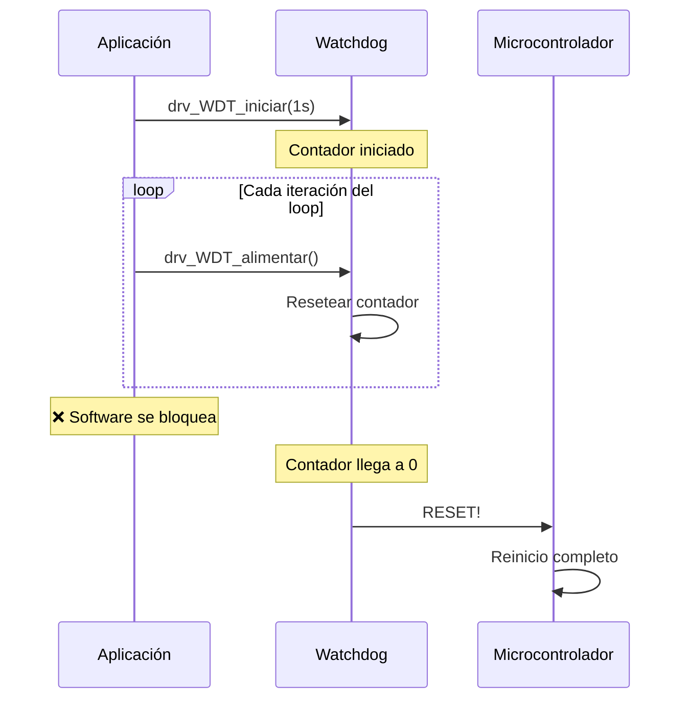

# 🐕 Funcionalidad: Watchdog Timer

## Introducción

El **Watchdog Timer** (WDT) es un mecanismo de seguridad que resetea el microcontrolador si el software se bloquea. Implementado mediante:
- **Driver**: `drv_WDT.c` (interfaz simple)
- **HAL LPC**: `hal_WDT_lpc.c` (watchdog interno del LPC2105)
- **HAL NRF**: `hal_WDT_nrf.c` (WDT del NRF52840)

## Principio de Funcionamiento



## API

```c
void drv_WDT_iniciar(uint32_t segundos);  // Iniciar watchdog
void drv_WDT_alimentar(void);              // "Kick" the dog
```

## Uso en el Proyecto

### Inicialización (rt_GE_iniciar)
```c
void rt_GE_iniciar(uint32_t monitor_overflow) {
    drv_WDT_iniciar(1);  // Timeout de 1 segundo
    // ...
}
```

### Alimentación Periódica (rt_GE_lanzador)
```c
void rt_GE_lanzador(void) {
    while (1) {
        drv_WDT_alimentar();  // Resetear contador cada iteración
        
        // Procesar eventos...
    }
}
```

## Configuración Hardware

### LPC2105
- **Registro**: `WDTC` (Counter), `WDMOD` (Mode)
- **Clock**: PCLK / 4
- **Timeout**: Configurable

### NRF52840
- **Periférico**: NRF_WDT
- **Reload Registers**: RR[0-7]
- **Comportamiento**: `CRV` (Counter Reload Value)

## Observaciones

1. **Solo LPC y NRF**: No hay implementación genérica (depende de hardware)
2. **No Desactivable**: Una vez iniciado, **no** se puede detener (excepto por reset)
3. **Timeout Conservador**: 1 segundo es suficiente para el event loop

---

[← Anterior: Alarmas](04_ALARMAS.md) | [Volver al índice](00_INDICE.md) | [Siguiente: GPIO →](06_GPIO.md)
