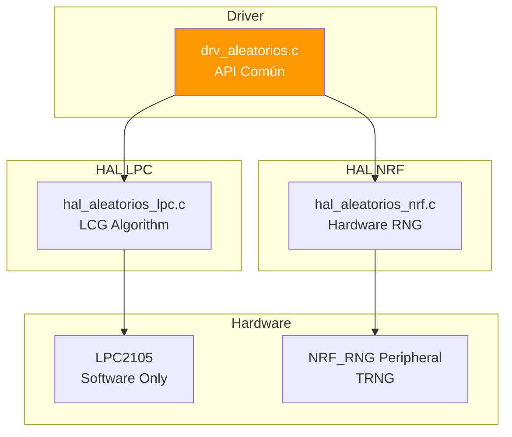

# 🎲 Funcionalidad: Generación de Números Aleatorios

## Introducción

El sistema de números aleatorios proporciona generación de valores pseudo-aleatorios (PRNG) o verdaderamente aleatorios (TRNG) según la plataforma. Utilizado principalmente para:
- **Generación de patrones** del juego Beat Hero
- **Variabilidad**: Evitar patrones predecibles
- **Dificultad dinámica**: Crear secuencias únicas en cada partida

## Arquitectura de Componentes



## Archivos Implicados

| Archivo | Capa | Descripción |
|---------|------|-------------|
| `drv_aleatorios.c` | Driver | Interfaz común, conversión a rango |
| `drv_aleatorios.h` | Driver | API pública |
| `hal_aleatorios_lpc.c` | HAL LPC | Implementación LCG |
| `hal_aleatorios_nrf.c` | HAL NRF | Acceso a periférico RNG |
| `hal_aleatorios.h` | HAL | Interfaz HAL común |

## API del Driver

### `void drv_aleatorios_iniciar(uint32_t semilla)`

**Propósito**: Inicializar el generador de números aleatorios

**Parámetro `semilla`**:
- **LPC**: Valor inicial del LCG. Si es `0`, usa timestamp automático
- **NRF**: **Ignorado** (hardware RNG no necesita semilla)

**Ejemplo**:
```c
// Inicializar con semilla automática (timestamp)
drv_aleatorios_iniciar(0);

// Inicializar con semilla específica (para reproducibilidad en tests)
drv_aleatorios_iniciar(12345);
```

### `uint32_t drv_aleatorios_obtener_32bits(void)`

**Propósito**: Obtener un número aleatorio de 32 bits completo

**Retorno**: Valor entre `0` y `0xFFFFFFFF` (4,294,967,295)

**Uso interno**: Base para `drv_aleatorios_rango()`

### `uint32_t drv_aleatorios_rango(uint32_t max)` ⭐

**Propósito**: Obtener número aleatorio en rango `[0, max-1]`

**Algoritmo**:
```c
uint32_t drv_aleatorios_rango(uint32_t rango) {
    if (rango == 0) return 0;
    uint32_t aleatorio = drv_aleatorios_obtener_32bits();
    return (aleatorio % rango);  // Módulo para ajustar al rango
}
```

**Ejemplos**:
```c
uint32_t dado = drv_aleatorios_rango(6);       // 0-5 (simular dado)
uint32_t porcentaje = drv_aleatorios_rango(100); // 0-99 (%)
uint32_t booleano = drv_aleatorios_rango(2);   // 0 o 1
```

**Nota sobre Sesgo**: El uso de módulo introduce un **sesgo estadístico** si `rango` no es divisor de `2^32`. Para el juego Beat Hero, el sesgo es despreciable.

## Uso en el Proyecto

### Generación de Patrones en Beat Hero

```c
static void avanzar_compas(void) {
    uint32_t rnd = drv_aleatorios_rango(100);  // 0-99
    uint8_t patron = 0;
    
    if (s_nivel_dificultad == 1) {
        // Nivel 1: Solo 1 botón (50% cada uno)
        patron = (rnd > 50) ? 1 : 2;
        
    } else if (s_nivel_dificultad == 2) {
        // Nivel 2: Introducir silencios
        patron = (rnd < 20) ? 0 : ((rnd < 60) ? 1 : 2);
        // 20% silencio, 40% botón1, 40% botón2
        
    } else {
        // Nivel 3/4: Incluir acordes (ambos botones)
        patron = (rnd < 15) ? 0 : 
                 ((rnd < 45) ? 1 : 
                 ((rnd < 75) ? 2 : 3));
        // 15% silencio, 30% bot1, 30% bot2, 25% acorde
    }
    
    compas[2] = patron;
}
```

### Distribución de Probabilidades

| Nivel | Silencio (0) | Botón 1 (1) | Botón 2 (2) | Acorde (3) |
|-------|--------------|-------------|-------------|------------|
| 1 | 0% | 50% | 50% | 0% |
| 2 | 20% | 40% | 40% | 0% |
| 3/4 | 15% | 30% | 30% | 25% |

## Implementación HAL - LPC2105

### Algoritmo LCG (Linear Congruential Generator)

El LPC2105 no tiene hardware RNG, por lo que usa un **algoritmo determinista** PARK-MILLER:

**Fórmula**:
```
X(n+1) = (a × X(n) + c) mod m
```

**Parámetros POSIX**:
- `a = 1103515245` (multiplicador)
- `c = 12345` (incremento)
- `m = 2^31` (módulo, implementado con máscara `& 0x7FFFFFFF`)

### Código LPC

```c
static uint32_t s_seed = 1;  // Semilla inicial

void hal_aleatorios_iniciar(uint32_t semilla) {
    if (semilla == 0) {
        // Semilla automática: usar timestamp en microsegundos
        s_seed = (uint32_t)drv_tiempo_actual_us();
    } else {
        s_seed = semilla;
    }
}

uint32_t hal_aleatorios_obtener_32bits(void) {
    // Aplicar fórmula LCG
    s_seed = (1103515245 * s_seed + 12345) & 0x7FFFFFFF;
    return s_seed;
}
```

### Características del LCG

| Aspecto | Valor |
|---------|-------|
| **Período** | 2^31 ≈ 2.1 mil millones |
| **Velocidad** | ~10 ciclos CPU (muy rápida) |
| **Calidad** | Media (pasa algunos tests estadísticos) |
| **Predecible** | Sí (conociendo semilla, secuencia reproducible) |

**Ventajas**:
- Muy rápido (1 multiplicación + 1 suma)
- Sin hardware especial
- Reproducible (útil para debugging)

**Desventajas**:
- No criptográficamente seguro
- Patrones visibles en bits de menor orden
- Requiere buena semilla inicial

## Implementación HAL - NRF52840

### Periférico RNG Hardware

El NRF52840 incluye un **True Random Number Generator (TRNG)** basado en ruido térmico del silicio.

### Registros del Periférico

| Registro | Dirección | Función |
|----------|-----------|---------|
| `NRF_RNG->TASKS_START` | 0x4000D000 | Iniciar generación |
| `NRF_RNG->TASKS_STOP` | 0x4000D004 | Detener generador |
| `NRF_RNG->EVENTS_VALRDY` | 0x4000D100 | Flag: Valor listo |
| `NRF_RNG->VALUE` | 0x4000D508 | Byte aleatorio (8 bits) |
| `NRF_RNG->CONFIG` | 0x4000D504 | Configuración (bias correction) |

### Código NRF

```c
static uint8_t obtener_byte_hw(void) {
    // Limpiar evento previo
    NRF_RNG->EVENTS_VALRDY = 0;
    
    // Esperar a que el hardware genere un byte (sin busy-wait)
    while (NRF_RNG->EVENTS_VALRDY == 0) {
        __WFE();  // Wait For Event (dormir CPU)
    }
    
    return (uint8_t)(NRF_RNG->VALUE & 0xFF);
}

void hal_aleatorios_iniciar(uint32_t semilla) {
    (void)semilla;  // Ignorado (TRNG no usa semilla)
    
    NRF_RNG->TASKS_STOP = 1;
    
    // Activar corrección de sesgo hardware
    NRF_RNG->CONFIG = (RNG_CONFIG_DERCEN_Enabled << RNG_CONFIG_DERCEN_Pos);
    
    NRF_RNG->TASKS_START = 1;
}

uint32_t hal_aleatorios_obtener_32bits(void) {
    uint32_t resultado = 0;
    
    // Hardware genera 8 bits/vez → leer 4 veces para 32 bits
    resultado |= obtener_byte_hw();
    resultado |= (obtener_byte_hw() << 8);
    resultado |= (obtener_byte_hw() << 16);
    resultado |= (obtener_byte_hw() << 24);
    
    return resultado;
}
```

### Características del Hardware RNG

| Aspecto | Valor |
|---------|-------|
| **Tipo** | TRNG (basado en ruido térmico) |
| **Velocidad** | ~16 µs por byte (moderada) |
| **Calidad** | Alta (pasa NIST SP 800-22) |
| **Predecible** | No (verdaderamente aleatorio) |
| **Consumo** | ~45 µA (bajo) |

**Ventajas**:
- Verdaderamente aleatorio (no reproducible)
- Pasa tests estadísticos estrictos
- Corrección de sesgo en hardware
- Bajo consumo energético

**Desventajas**:
- Más lento que LCG software
- Requiere hardware específico
- 4 lecturas para obtener 32 bits

### Optimización con WFE

El código NRF usa `__WFE()` (Wait For Event):

```c
while (NRF_RNG->EVENTS_VALRDY == 0) {
    __WFE();  // CPU dormida hasta evento hardware
}
```

**Beneficio**: En lugar de busy-wait, la CPU se duerme (~16 µs) → ahorro energético

## Comparación LPC vs NRF

| Característica | LPC2105 (LCG) | NRF52840 (TRNG) |
|----------------|---------------|-----------------|
| **Tipo** | Pseudo-aleatorio | Verdaderamente aleatorio |
| **Algoritmo** | PARK-MILLER LCG | Ruido térmico analógico |
| **Período** | 2^31 valores | Infinito (no periódico) |
| **Velocidad** | ~10 ciclos | ~1024 ciclos (16 µs) |
| **Predecible** | Sí (conociendo semilla) | No |
| **Uso de hardware** | Solo ALU | Periférico RNG dedicado |
| **Calidad estadística** | Media | Alta (NIST SP 800-22) |
| **Consumo** | Despreciable | 45 µA |
| **Reproducibilidad** | Sí (útil tests) | No |

## Calidad Estadística

### Tests Aplicables

Ambas implementaciones deberían pasar:
- **Chi-cuadrado**: Distribución uniforme
- **Runs test**: No hay patrones repetitivos
- **Correlation**: Independencia entre valores

Solo NRF pasa:
- **NIST SP 800-22**: Suite completa de tests criptográficos
- **Entropy**: Entropía máxima (8 bits por byte)

### Para Beat Hero

**Requisito**: Distribución aproximadamente uniforme

**Conclusión**: Ambas implementaciones son **más que suficientes**. La diferencia de calidad es imperceptible para el jugador.

## Sesgo del Módulo

### Problema Teórico

```c
return (aleatorio % rango);
```

Si `rango` no divide exactamente a `2^32`, hay un **ligero sesgo** hacia valores bajos.

**Ejemplo extremo**:
- `rango = 3`
- Valores posibles: `0xFFFFFFFF` (4,294,967,295)
- `4294967295 % 3 = 0` → **0 aparece una vez más**

### Sesgo en Beat Hero

```c
drv_aleatorios_rango(100);  // Beat Hero usa 100
```

**Cálculo**:
- `2^32 = 4,294,967,296`
- `4294967296 % 100 = 96`
- **Sesgo**: 96 valores tienen probabilidad `42,949,673/4,294,967,296`
- Resto tienen probabilidad `42,949,672/4,294,967,296`
- **Diferencia**: ~0.000000023% (despreciable)

### Alternativa Sin Sesgo (No Implementada)

```c
uint32_t drv_aleatorios_rango_sin_sesgo(uint32_t rango) {
    uint32_t limite = (UINT32_MAX / rango) * rango;
    uint32_t aleatorio;
    
    do {
        aleatorio = drv_aleatorios_obtener_32bits();
    } while (aleatorio >= limite);  // Rechazar valores sesgados
    
    return aleatorio % rango;
}
```

**Trade-off**: Elimina sesgo pero puede requerir múltiples llamadas.

## Configuración Hardware

### LPC2105

**No requiere configuración** - Puramente software.

**Semilla Recomendada**: Timestamp (`drv_tiempo_actual_us()`)

### NRF52840

**Registro CONFIG**:
```c
NRF_RNG->CONFIG = (RNG_CONFIG_DERCEN_Enabled << RNG_CONFIG_DERCEN_Pos);
```

- **DERCEN** (Digital Error Correction): Corrección de sesgo por hardware
  - `Enabled`: Activar (recomendado, mejora calidad)
  - `Disabled`: Desactivar (más rápido, menor calidad)

**Clock**: El RNG usa HFCLK (16 MHz) automáticamente.

## Dependencias

### Requiere
- **drv_tiempo.c** (solo LPC): Para semilla automática con timestamp

### Usado Por
1. **beat_hero.c**: Generación de patrones (`avanzar_compas()`)
2. **test.c** (potencialmente): Tests de aleatoriedad

## Observaciones Técnicas

### 1. **Reproducibilidad en Tests**

LPC permite reproducir secuencias:
```c
// Test determinista
drv_aleatorios_iniciar(12345);
uint32_t v1 = drv_aleatorios_rango(100);  // Siempre igual
```

NRF no es reproducible (TRNG).

### 2. **Periodo del LCG**

Con `a=1103515245`, `c=12345`, `m=2^31`:
- **Período completo**: 2^31 (Hull-Dobell theorem)
- **2.1 mil millones** de valores antes de repetir
- Para Beat Hero: ~70,000 partidas sin repetición

### 3. **Bits de Mayor vs Menor Orden**

En LCG, los **bits altos** tienen mejor calidad que los bajos:
```c
// ❌ MAL: Usar bits bajos directamente
uint8_t bad = s_seed & 0xFF;

// ✅ BIEN: Usar valor completo y módulo
uint8_t good = drv_aleatorios_rango(256);
```

El driver ya hace esto correctamente.

### 4. **Consumo Energético NRF**

Generar un número de 32 bits:
- 4 bytes × 16 µs = **64 µs**
- Consumo: 45 µA × 64 µs = **2.88 nJ**

Despreciable comparado con el resto del sistema.

### 5. **No es Criptográficamente Seguro**

**LPC**: LCG es predecible (no usar para criptografía)

**NRF**: Aunque es TRNG, Nordic recomienda **no** usar`NRF_RNG` para claves criptográficas (usar `NRF_CC310` si disponible).

**Para Beat Hero**: No es relevante (no hay seguridad crítica).

---

[← Anterior: Interrupciones](07_INTERRUPCIONES.md) | [Volver al índice](00_INDICE.md) | [Siguiente: LEDs →](09_LEDS.md)
