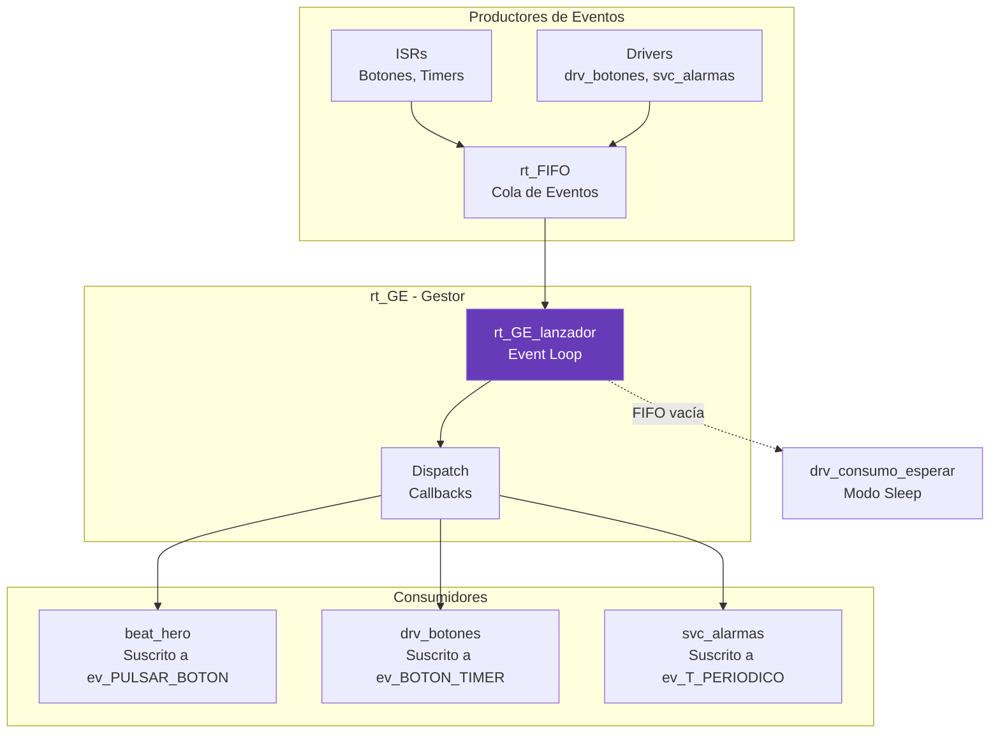
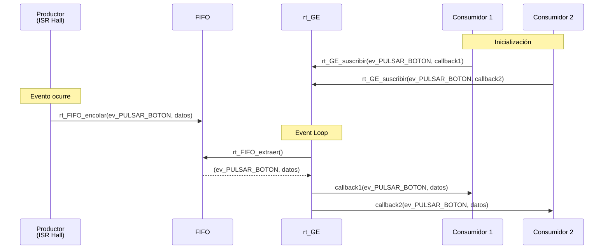
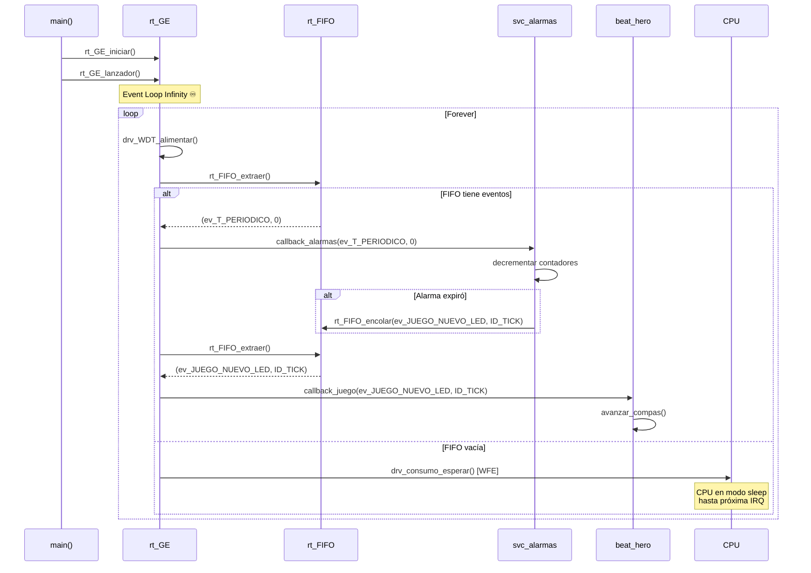

# 🔄 Funcionalidad: Sistema de Eventos (rt_GE)

## Introducción

El **Gestor de Eventos** (`rt_GE`) es el núcleo del sistema basado en eventos. Implementa:
- **Patrón Pub/Sub** (Publicador-Suscriptor)
- **Bucle de eventos** (Event Loop) no bloqueante
- **Dispatch** de callbacks según tipo de evento
- **Prioridades** en suscripciones
- **Gestión de inactividad** y modo de bajo consumo

## Arquitectura de Componentes



## Archivos Implicados

| Archivo | Capa | Descripción |
|---------|------|-------------|
| `rt_GE.c` | Runtime | Gestor de eventos y event loop |
| `rt_GE.h` | Runtime | Interfaz pública |
| `rt_fifo.c` | Runtime | Cola FIFO (ver doc separada) |
| `rt_evento_t.h` | Runtime | Tipos de eventos |

## Modelo de Programación

### Patrón Pub/Sub



### Tipo de Callback

```c
typedef void (*f_callback_GE)(EVENTO_T ID_evento, uint32_t auxData);
```

**Ejemplo**:
```c
void mi_callback(EVENTO_T ID_evento, uint32_t auxData) {
    if (ID_evento == ev_PULSAR_BOTON) {
        uint8_t button_id = (uint8_t)auxData;
        // Procesar pulsación...
    }
}
```

## Estructura de Datos

### Tabla de Suscripciones

```c
#define rt_GE_MAX_SUSCRITOS 4  // Máx 4 callbacks por tipo de evento

typedef struct {
    f_callback_GE callback;
    uint8_t prioridad;
} TareaSuscrita_t;

static TareaSuscrita_t TareasSuscritas[EVENT_TYPES][rt_GE_MAX_SUSCRITOS];
static uint8_t numSuscritos[EVENT_TYPES];
```

**Organización**:
- Array 2D: `[Tipo_de_Evento][Índice_Suscriptor]`
- Cada tipo de evento puede tener hasta 4 suscriptores
- Ordenados por prioridad: 0 (alta) → 255 (baja)

## Funciones Principales

### `void rt_GE_iniciar(uint32_t monitor_overflow)`

**Acciones**:
1. Iniciar watchdog: `drv_WDT_iniciar(1)` (1 segundo)
2. Inicializar tablas de suscripciones
3. Auto-suscribirse a eventos de sistema:
   ```c
   rt_GE_suscribir(ev_INACTIVIDAD, 0, rt_GE_actualizar);
   rt_GE_suscribir(ev_PULSAR_BOTON, 1, rt_GE_actualizar);
   ```

**Nota**: El propio `rt_GE` se suscribe para gestionar inactividad

### `void rt_GE_lanzador(void)` ⭐ (Event Loop)

**Pseudocódigo**:
```c
void rt_GE_lanzador(void) {
    // Programar alarma de inactividad
    svc_alarma_activar(10s, ev_INACTIVIDAD, 0);
    
    while (1) {  // Bucle infinito
        drv_WDT_alimentar();  // Evitar reset por watchdog
        
        if (rt_FIFO_extraer(&evento, &auxData, &timestamp)) {
            // Hay evento → Despachar
            for (cada suscriptor de 'evento') {
                suscriptor.callback(evento, auxData);
            }
        } else {
            // FIFO vacía → Dormir CPU
            drv_consumo_esperar();  // WFE/WFI
        }
    }
}
```

**Características**:
- **No bloqueante**: usa `drv_consumo_esperar()` cuando no hay eventos
- **Watchdog**: alimentado en cada iteración
- **Secciones críticas**: extraer de FIFO es atómico
- **Debug**: registra latencia (tiempo entre generación y procesamiento)

### `void rt_GE_suscribir(EVENTO_T ID_evento, uint8_t prioridad, f_callback_GE f_callback)`

**Propósito**: Registrar callback para un tipo de evento

**Algoritmo de Inserción Ordenada**:
```c
// 1. Verificar espacio
if (numSuscritos[ID_evento] >= rt_GE_MAX_SUSCRITOS) {
    drv_monitor_marcar(g_M_overflow_monitor_id);
    while(1);  // Error crítico
}

// 2. Insertar manteniendo orden por prioridad (insertion sort)
int i = numSuscritos[ID_evento];
while (i > 0 && TareasSuscritas[ID_evento][i-1].prioridad > prioridad) {
    TareasSuscritas[ID_evento][i] = TareasSuscritas[ID_evento][i-1];
    i--;
}

TareasSuscritas[ID_evento][i].callback = f_callback;
TareasSuscritas[ID_evento][i].prioridad = prioridad;
numSuscritos[ID_evento]++;
```

**Ejemplo**:
```c
// Alta prioridad: procesar primero
rt_GE_suscribir(ev_PULSAR_BOTON, 0, callback_alta_prioridad);

// Baja prioridad: procesar después
rt_GE_suscribir(ev_PULSAR_BOTON, 100, callback_baja_prioridad);
```

### `void rt_GE_cancelar(EVENTO_T ID_evento, f_callback_GE f_callback)`

**Propósito**: Desuscribirse de un evento

**Algoritmo**:
1. Buscar callback en array
2. Desplazar elementos posteriores
3. Decrementar `numSuscritos[ID_evento]`

### `void rt_GE_actualizar(EVENTO_T ID_evento, uint32_t auxiliar)`

**Propósito**: Callback interno del gestor para eventos de sistema

**Lógica**:
```c
switch (ID_evento) {
    case ev_INACTIVIDAD:
        drv_consumo_dormir();  // Entrar en deep sleep
        break;
    
    case ev_PULSAR_BOTON:
        // Resetear timer de inactividad
        svc_alarma_activar(10s, ev_INACTIVIDAD, 0);
        break;
}
```

## Flujo de Ejecución Típico



## Gestión de Inactividad

### Mecanismo

1. **Inicialización**: Alarma de 10 segundos
2. **Actividad detectada**: Reseteo de alarma al pulsar botón
3. **Timeout**: Evento `ev_INACTIVIDAD` → `drv_consumo_dormir()`
4. **Despertar**: Próxima interrupción (botón, timer, etc.)

```c
#define INACTIVITY_TIME_MS 10000  // 10 segundos

// En rt_GE_lanzador():
svc_alarma_activar(10s, ev_INACTIVIDAD, 0);

// En rt_GE_actualizar():
case ev_PULSAR_BOTON:
    svc_alarma_activar(10s, ev_INACTIVIDAD, 0);  // Reset
```

## Debug y Profiling

### Métricas de Latencia

```c
#ifdef DEBUG
volatile uint32_t dbg_ge_latencia_min = 0xFFFFFFFF;
volatile uint32_t dbg_ge_latencia_max = 0;
volatile uint32_t dbg_ge_hist[5] = {0,0,0,0,0};  // Histograma
#endif
```

**Medición**:
```c
void registrar_latencia(Tiempo_us_t ts_evento) {
    Tiempo_us_t ahora = drv_tiempo_actual_us();
    uint32_t latencia = (uint32_t)(ahora - ts_evento);
    
    if (latencia < dbg_ge_latencia_min) dbg_ge_latencia_min = latencia;
    if (latencia > dbg_ge_latencia_max) dbg_ge_latencia_max = latencia;
    
    // Clasificar en buckets
    if (latencia_ms < 1)       dbg_ge_hist[0]++;      // <1ms
    else if (latencia_ms < 10) dbg_ge_hist[1]++;      // 1-10ms
    else if (latencia_ms < 50) dbg_ge_hist[2]++;      // 10-50ms
    else if (latencia_ms < 100)dbg_ge_hist[3]++;      // 50-100ms
    else                       dbg_ge_hist[4]++;      // >100ms
}
```

**Uso**: Inspeccionar variables en debugger para detectar cuellos de botella

## Dependencias

### Requiere
1. **rt_FIFO.c**: Cola de eventos
2. **drv_SC.c**: Secciones críticas
3. **drv_WDT.c**: Watchdog
4. **drv_consumo.c**: Modos de bajo consumo
5. **drv_tiempo.c**: Timestamps (solo en debug)

### Usado Por
- **Toda la aplicación**: Es el despachador central de eventos

## Características Avanzadas

### 1. **Prioridades**

Callbacks de **menor** número se ejecutan **primero**:
```c
// Orden de ejecución:
rt_GE_suscribir(ev_X, 0, callback_A);  // 1º
rt_GE_suscribir(ev_X, 5, callback_B);  // 2º
rt_GE_suscribir(ev_X, 10, callback_C); // 3º
```

### 2. **Secciones Críticas en FIFO**

```c
uint32_t sc = drv_SC_entrar_disable_irq();
bool hay_evento = rt_FIFO_extraer(&evento, &auxData, &timestamp);
drv_SC_salir_enable_irq();
```

**Propósito**: Evitar race condition entre ISR que encolan y loop que extrae

### 3. **Watchdog Integrado**

El gestor alimenta automáticamente el watchdog:
```c
while (1) {
    drv_WDT_alimentar();  // Si el loop se bloquea, el micro se resetea
    // ...
}
```

### 4. **Optimización Energética**

Cuando la FIFO está vacía → CPU en WFE (Wait For Event):
```c
if (!hay_eventos) {
    drv_consumo_esperar();  // WFE instruction
}
```

**Ahorro**: ~90% de consumo vs busy-wait

## Comparación: Polling vs Event-Driven

| Aspecto | Polling | Event-Driven (rt_GE) |
|---------|---------|----------------------|
| **CPU** | 100% activa | Dormida cuando inactiva |
| **Latencia** | Variable (depende del polling rate) | Baja (dispatch directo) |
| **Consumo** | Alto | Muy bajo |
| **Complejidad** | Simple | Moderada |
| **Escalabilidad** | Mala | Excelente |

## Limitaciones y Consideraciones

### 1. **Máximo de Suscriptores**
```c
#define rt_GE_MAX_SUSCRITOS 4
```
- Si se excede → bloqueo del sistema
- **Solución**: Aumentar macro (trade-off: RAM)

### 2 **Callbacks No Bloqueantes**
Los callbacks **deben** ser rápidos:
```c
void mi_callback(EVENTO_T evento, uint32_t auxData) {
    // ✅ CORRECTO
    bool flag = true;
    
    // ❌ INCORRECTO
    drv_tiempo_esperar_ms(1000);  // Bloquea todo el sistema
}
```

### 3. **Orden de Ejecución**
Callbacks del mismo evento se ejecutan **secuencialmente** (no en paralelo).

### 4. **Pérdida de Eventos**
Si la FIFO se llena, eventos nuevos se pierden (overflow).

---

[← Anterior: Consumo](10_CONSUMO.md) | [Volver al índice](00_INDICE.md) | [Siguiente: FIFO →](12_FIFO.md)
