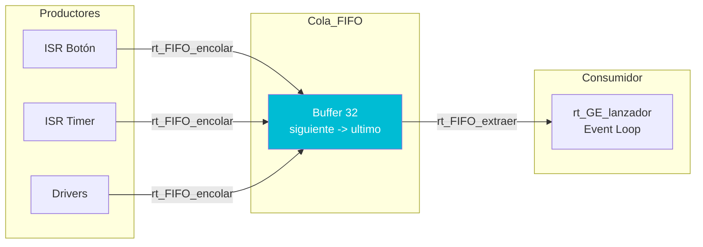

# 📥 Funcionalidad: Cola FIFO de Eventos

## Introducción

La cola FIFO (`rt_fifo`) implementa una **cola circular thread-safe** para almacenar eventos temporalmente. Características:
- **FIFO** (First In, First Out): orden de procesamiento garantizado
- **Thread-safe**: protección con secciones críticas
- **Timestamps**: cada evento incluye marca de tiempo
- **Overflow detection**: detección de saturación
- **Debug stats**: estadísticas de uso

## Arquitectura



## Estructura de Datos

### Evento

```c
typedef struct {
    EVENTO_T ID_EVENTO;   // Tipo de evento
    uint32_t auxData;      // Datos auxiliares
    Tiempo_us_t TS;        // Timestamp (microsegundos)
} EVENTO;
```

### Cola Circular

```c
#define TAMCOLA 32

typedef struct {
    EVENTO cola[TAMCOLA];
    MONITOR_id_t monitor;
    indice_cola_t ultimo_tratado;        // Índice del último extraído
    indice_cola_t siguiente_a_tratar;    // Índice del próximo a extraer
    volatile uint32_t eventos_a_tratar;  // Contador de eventos pendientes
} RT_FIFO;
```

**Invariantes**:
- `eventos_a_tratar == 0` → cola vacía
- `eventos_a_tratar == TAMCOLA` → cola llena
- `(siguiente_a_tratar + eventos_a_tratar - 1) % TAMCOLA` → último elemento

## Funciones

### `void rt_FIFO_inicializar(uint32_t monitor_overflow)`

```c
s_rt_fifo.ultimo_tratado = 0;
s_rt_fifo.siguiente_a_tratar = 0;
s_rt_fifo.eventos_a_tratar = 0;
s_rt_fifo.monitor = monitor_overflow;
```

### `void rt_FIFO_encolar(uint32_t ID_evento, uint32_t auxData)` ⭐

**Algoritmo**:
```c
void rt_FIFO_encolar(uint32_t ID_evento, uint32_t auxData) {
    EVENTO ev = {
        .ID_EVENTO = ID_evento,
        .auxData = auxData,
        .TS = drv_tiempo_actual_us()  // Timestamp
    };
    
    // ===== SECCIÓN CRÍTICA =====
    drv_SC_entrar_disable_irq();
    
    s_rt_fifo.eventos_a_tratar++;
    
    if (s_rt_fifo.eventos_a_tratar > TAMCOLA) {
        drv_monitor_marcar(s_rt_fifo.monitor);  // Overflow!
        while(1);  // Bloquear sistema
    }
    
    uint32_t indice = (s_rt_fifo.siguiente_a_tratar + s_rt_fifo.eventos_a_tratar - 1) % TAMCOLA;
    s_rt_fifo.cola[indice] = ev;
    
    drv_SC_salir_enable_irq();
    // ===== FIN SECCIÓN CRÍTICA =====
}
```

**Thread-Safety**: Las ISRs pueden llamar a esta función → protección con SC

### `uint8_t rt_FIFO_extraer(EVENTO_T *ID_evento, uint32_t *auxData, Tiempo_us_t *TS)`

**Algoritmo**:
```c
uint8_t rt_FIFO_extraer(...) {
    // ===== SECCIÓN CRÍTICA =====
    drv_SC_entrar_disable_irq();
    
    if (s_rt_fifo.eventos_a_tratar == 0) {
       drv_SC_salir_enable_irq();
        return 0;  // Cola vacía
    }
    
    EVENTO ev = s_rt_fifo.cola[s_rt_fifo.siguiente_a_tratar];
    s_rt_fifo.siguiente_a_tratar = (s_rt_fifo.siguiente_a_tratar + 1) % TAMCOLA;
    s_rt_fifo.eventos_a_tratar--;
    
    uint8_t ret = (s_rt_fifo.eventos_a_tratar == 0) ? 1 : s_rt_fifo.eventos_a_tratar;
    
    drv_SC_salir_enable_irq();
    // ===== FIN SECCIÓN CRÍTICA =====
    
    *ID_evento = ev.ID_EVENTO;
    *auxData = ev.auxData;
    *TS = ev.TS;
    
    return ret;  // 0=vacía, 1=último extraído, >1=quedan eventos
}
```

**Retorno**:
- `0`: Cola estaba vacía
- `1`: Se extrajo el último evento
- `>1`: Quedan `N` eventos pendientes

## Características Clave

### 1. **Cola Circular (Ring Buffer)**

```
Indices:  0   1   2   3   4   ...  31
         [A] [B] [C] [ ] [ ] ... [ ]
          ↑       ↑
      siguiente  último
```

**Ventaja**: No hay reubicación de elementos → O(1) encolar/extraer

### 2. **Timestamps Automáticos**

Cada evento registra `drv_tiempo_actual_us()` al encolarse:
- **Útil para**: Medir latencias, profiling, debug

### 3. **Protección con Secciones Críticas**

```c
drv_SC_entrar_disable_irq();   // Deshabilitar interrupciones
// Código crítico...
drv_SC_salir_enable_irq();     // Rehabilitar interrupciones
```

**Necesario porque**: ISRs pueden encolar mientras el loop extrae

### 4. **Debug Statistics** (opcional)

```c
#ifdef DEBUG
volatile uint32_t dbg_fifo_stats[EVENT_TYPES + 1];  // Eventos por tipo
volatile uint32_t dbg_fifo_uso_actual;               // Ocupación actual
volatile uint32_t dbg_fifo_uso_max;                  // Máxima ocupación
volatile uint32_t dbg_fifo_total_encolados;          // Total histórico
#endif
```

## Dependencias

- **drv_SC.c**: Secciones críticas
- **drv_tiempo.c**: Timestamps
- **drv_monitor.c**: Señalización de overflow

## Observaciones Técnicas

### 1. **Tamaño de Cola vs Latencia**

- Cola pequeña (16) → menor RAM, mayor riesgo de overflow
- Cola grande (64) → más RAM, menor riesgo

**Configuración actual**: `TAMCOLA = 32` (balance razonable)

### 2. **Overflow es Crítico**

Si la cola se llena → **sistema bloqueado**:
```c
if (eventos_a_tratar > TAMCOLA) {
    drv_monitor_marcar(monitor);
    while(1);  // No hay recuperación
}
```

**Prevención**: Procesar eventos rápidamente en callbacks

### 3. **Volatile es Crítico**

```c
volatile uint32_t eventos_a_tratar;
```

**Razón**: Modificado por ISRs → evitar optimizaciones del compilador

---

[← Anterior: Eventos](11_EVENTOS.md) | [Volver al índice](00_INDICE.md) | [Siguiente: Sección Crítica →](13_SECCION_CRITICA.md)
