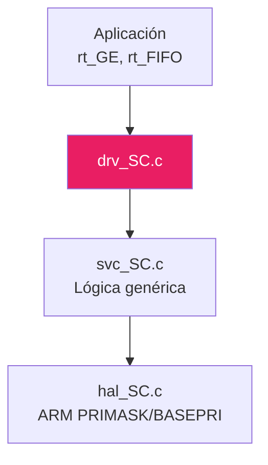

# 🔒 Funcionalidad: Secciones Críticas

## Introducción

Las **secciones críticas** protegen recursos compartidos entre código de usuario (main loop) e ISRs. En este proyecto se usan para:
- Proteger acceso a la cola FIFO
- Evitar race conditions
- Garantizar atomicidad en operaciones multi-paso

## Arquitectura en Capas



## Archivos

| Archivo | Capa | Descripción |
|---------|------|-------------|
| `drv_SC.c` | Driver | Wrapper simple sobre servicio |
| `svc_SC.c` | Servicio | Lógica de entrada/salida |
| `hal_SC.c` | HAL | Manipulación de registros ARM |

## API

### Funciones Principales

```c
uint32_t drv_SC_entrar_disable_irq(void);
void drv_SC_salir_enable_irq(void);
```

**Uso Típico**:
```c
uint32_t estado_anterior = drv_SC_entrar_disable_irq();
// Código crítico (no interrumpible)
drv_SC_salir_enable_irq();
```

## Implementación HAL (ARM Cortex)

### Usando PRIMASK (Deshabilitar TODAS las IRQs)

```c
// hal_SC.c
uint32_t hal_SC_entrar() {
    uint32_t primask;
    __asm volatile ("MRS %0, PRIMASK" : "=r" (primask));
    __asm volatile ("CPSID I");  // Disable IRQs
    return primask;
}

void hal_SC_salir() {
    __asm volatile ("CPSIE I");  // Enable IRQs
}
```

**Ventaja**: Simple, rápido  
**Desventaja**: Deshabilitainterrupciones críticas (NMI sigue activa)

### Alternativa: BASEPRI (Deshabilitar por Prioridad)

```c
uint32_t hal_SC_entrar_basepri(uint8_t umbral_prioridad) {
    uint32_t basepri;
    __asm volatile ("MRS %0, BASEPRI" : "=r" (basepri));
    __asm volatile ("MSR BASEPRI, %0" :: "r" (umbral_prioridad << 4));
    return basepri;
}
```

**Ventaja**: Permite interrupciones de alta prioridad  
**Desventaja**: Más complejo

## Uso en el Proyecto

### rt_FIFO_encolar

```c
void rt_FIFO_encolar(uint32_t ID_evento, uint32_t auxData) {
    uint32_t sc = drv_SC_entrar_disable_irq();
    
    s_rt_fifo.eventos_a_tratar++;
    s_rt_fifo.cola[indice] = evento;
    
    drv_SC_salir_enable_irq();
}
```

**Protege**: Modificación concurrente de `eventos_a_tratar` y escribir en el buffer

### rt_GE_lanzador

```c
while (1) {
    uint32_t sc = drv_SC_entrar_disable_irq();
    bool hay_evento = rt_FIFO_extraer(...);
    drv_SC_salir_enable_irq();
    
    if (hay_evento) {
        // Procesar...
    }
}
```

## Observaciones Técnicas

### 1. **No Anidar Secciones Críticas**
```c
// ❌ EVITAR
sc1 = drv_SC_entrar();
sc2 = drv_SC_entrar();  // Problemático
drv_SC_salir();
drv_SC_salir();
```

### 2. **Minimizar Tiempo en SC**
```c
// ✅ CORRECTO
sc = drv_SC_entrar();
dato = buffer[i];  // Lectura rápida
drv_SC_salir();
procesar(dato);    // Procesamiento fuera de SC

// ❌ INCORRECTO
sc = drv_SC_entrar();
dato = buffer[i];
procesar(dato);    // Bloquea IRQs innecesariamente
drv_SC_salir();
```

### 3. **Portable entre LPC y NRF**
El HAL abstrae diferencias de hardware → mismo código funciona en ambas plataformas

---

[← Anterior: FIFO](12_FIFO.md) | [Volver al índice](00_INDICE.md)
