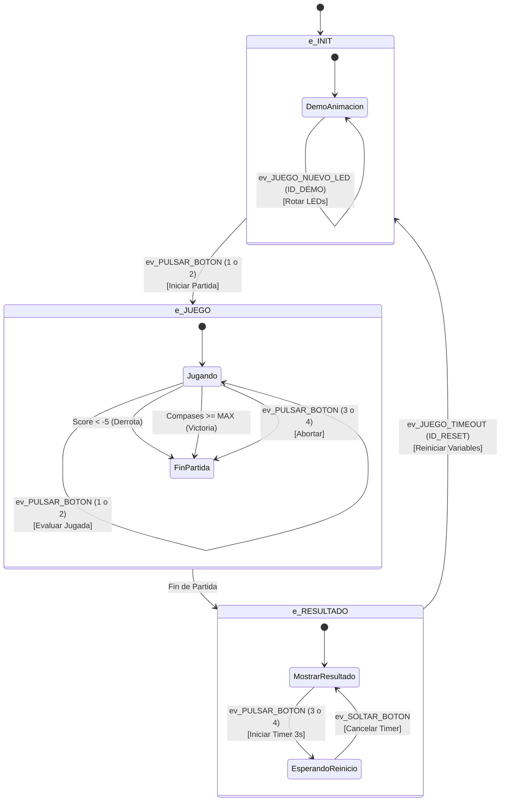

# Diagrama de Máquina de Estados - Beat Hero

Este documento describe la lógica de la máquina de estados implementada en `beat_hero.c`.

## Descripción de Estados

1. **e_INIT (Menú Principal)**
   - Muestra una animación de demostración en los LEDs.
   - Espera a que el usuario pulse el botón 1 o 2 para comenzar.

2. **e_JUEGO (Partida en Curso)**
   - **Tick de Juego:** Cada cierto tiempo (según BPM) avanza el compás y actualiza los LEDs.
   - **Interacción:** Evalúa las pulsaciones de los botones 1 y 2.
   - **Condiciones de Fin:**
     - **Victoria:** Completar todos los compases.
     - **Derrota:** Puntuación demasiado baja.
     - **Abortar:** Pulsar botones 3 o 4.

3. **e_RESULTADO (Pantalla Final)**
   - Muestra el resultado (todos los LEDs encendidos para victoria, cruz para derrota).
   - Permite reiniciar manteniendo pulsados los botones 3 o 4 durante 3 segundos.
