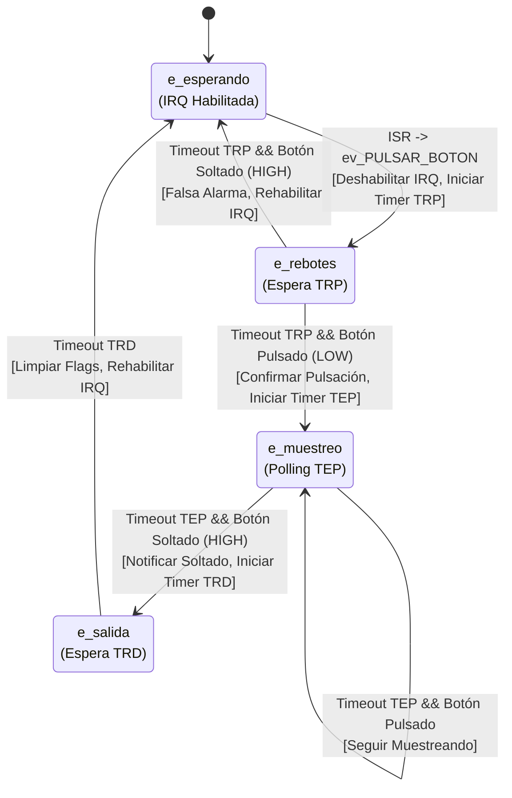

# Diagrama de Máquina de Estados - Driver Botones

Este documento describe la lógica de la máquina de estados implementada en `drv_botones.c` para la gestión de rebotes e interrupciones.

## Descripción de Estados

1. **e_esperando**
   - Estado inicial.
   - La interrupción del botón está habilitada.
   - Espera a que el usuario pulse el botón (flanco de bajada).

2. **e_rebotes**
   - Se entra tras detectar una interrupción.
   - Se espera un tiempo `TRP_MS` (80ms) para filtrar rebotes mecánicos iniciales.
   - Al finalizar el tiempo, se verifica el estado real del pin.

3. **e_muestreo**
   - Estado estable de "Botón Pulsado".
   - Se verifica periódicamente cada `TEP_MS` (50ms) si el botón sigue pulsado.
   - Si se detecta que se ha soltado, se pasa al estado de salida.

4. **e_salida**
   - Se espera un tiempo de seguridad `TRD_MS` (50ms) para evitar rebotes al soltar.
   - Tras este tiempo, se limpian las interrupciones pendientes y se rehabilitan para el próximo ciclo.
